# How to Push Changes Using Only the GitHub Website

This guide explains how to safely make and submit changes to the repository without cloning the repo or using the command line.

You will:

- Create your own branch
- Make edits to the content
- Submit a Pull Request (PR)

This keeps the **main** branch protected and prevents accidental site breaks.

[**Check that your branch is not behind in commits from the main branch before trying to push changes**](#keeping-your-branch-up-to-date-with-main-update-branch)

## Step 1 - Create Your Own Branch

- Got to the repository on GitHub
- At the top left, click the branch dropdown and type a new branch name

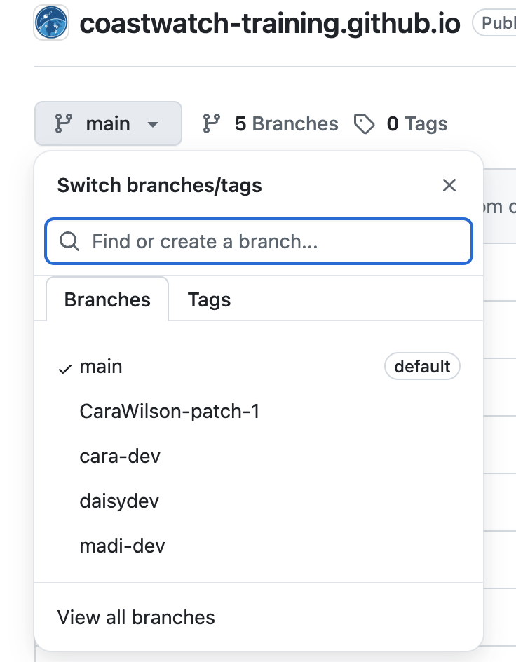

For this example, we are using the branch madi-dev.

## Step 2 - Edit a file

- Navigate to the file you want to edit by clicking the pencil icon (in the red box)

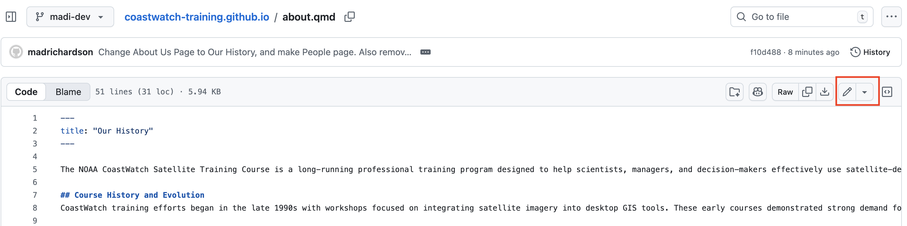

- After making changes click "Commit Changes"

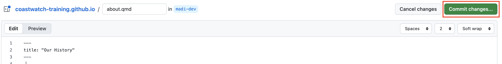

Your edit is now saved to your branch.

## Step 3 - Open a Pull Request

After committing, GitHub will show this on the main branch:

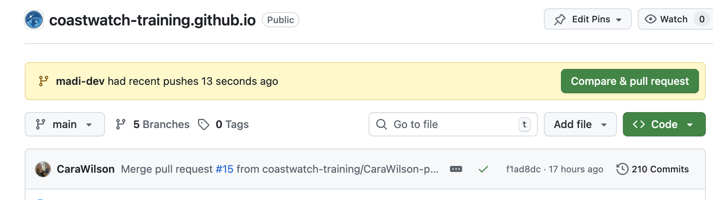

Then, add a short description:

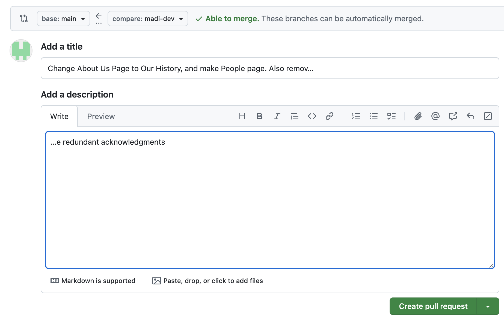

## Step 4 - Merge 

Once the changes have been approved and there are no conflicts with main, click "Merge pull request"

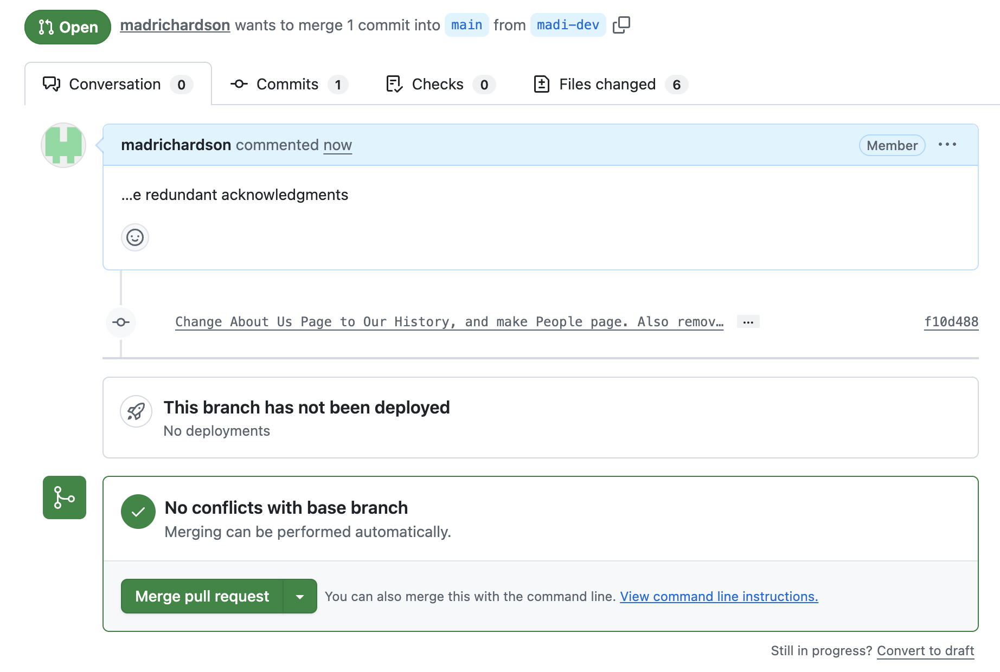

Then, confirm the merge:

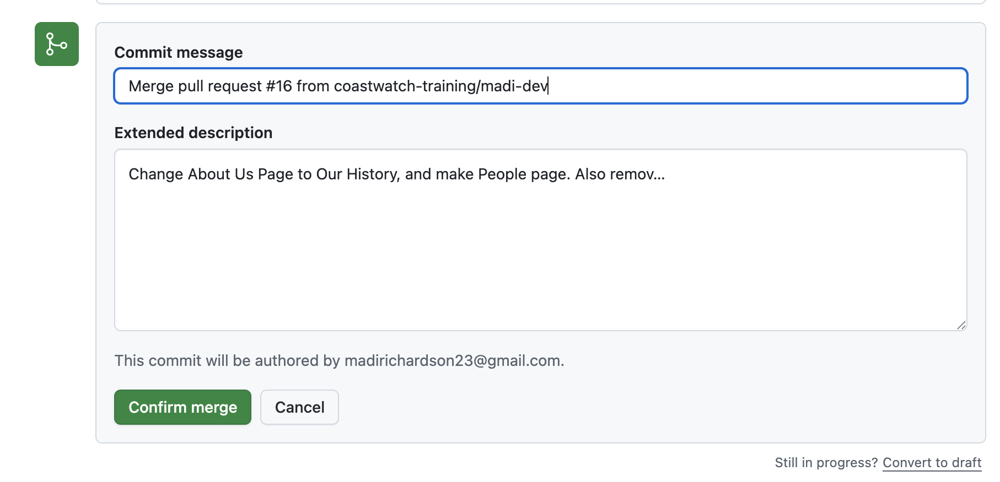

The merge has been successful!

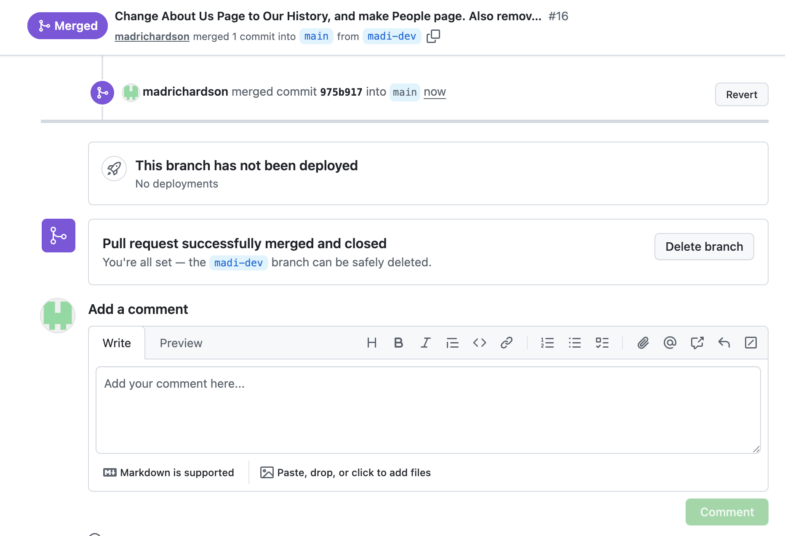

## Step 5 - Check That There Are No Issues Merging

Go back to the main branch and wait for the brown dot (pending changes) to a green checkmark (successfully updated).

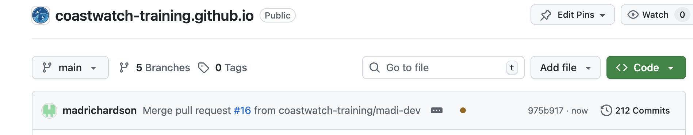

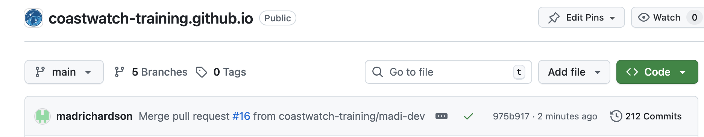

---

# Keeping Your Branch Up to Date With Main

If other people are merging changes into **main**, your branch can fall behind.

Before opening (or merging) a Pull Request, you should make sure your branch is up to date. 

## Why This Matters

If your branch is behind **main**, you may see:

- "This branch is out of date"
- Merge conflicts
- Unexpected overwrites
- Broken navigation (for Quarto sites)

Keeping your branch current prevents conflicts.

## Step 1 - Open a Pull Request

Check that status of your branch first:

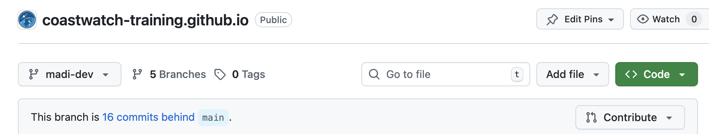

The branch we are using as an example is 16 commits behind main.

Navigate to the Pull Requests and open a New Pull Request:

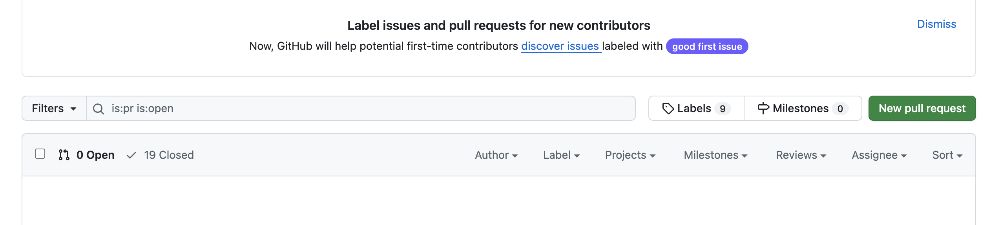

## Step 2 - Comparing Changes

After opening the PR, change the base (red box) to your branch (madi-dev), and the compare branch (orange box) to the main branch.

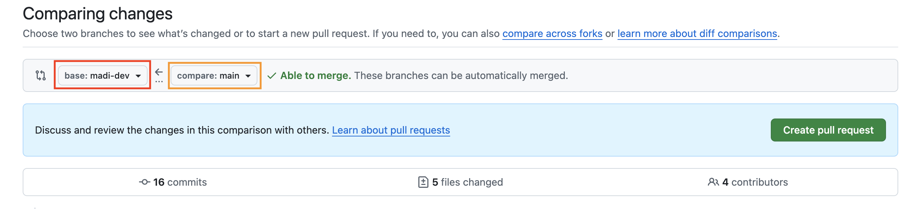

If we can merge the branches, then a green check mark saying "Able to Merge" will appear next to the boxes. 

Now, Create the Pull Request.

## Step 3 - Merge the Branch with Main

Create title and description of why you are merging the branches. Then, create PR.

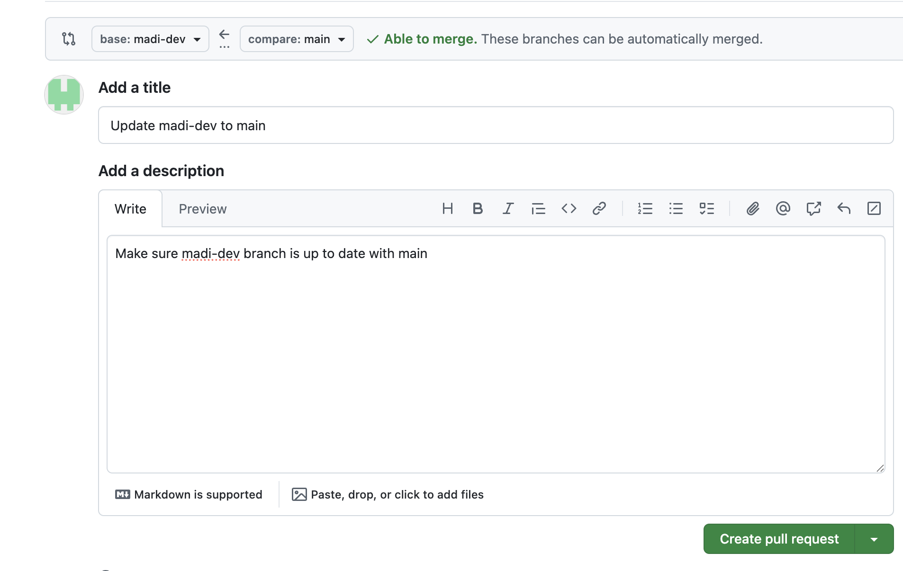

GitHub will automatically check for conflicts between branches, and then allow you to merge them.

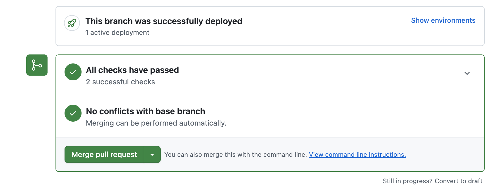

Now, your branch is sucessfully updated to the main branch! You can now make edits on your branch and push them to main. 