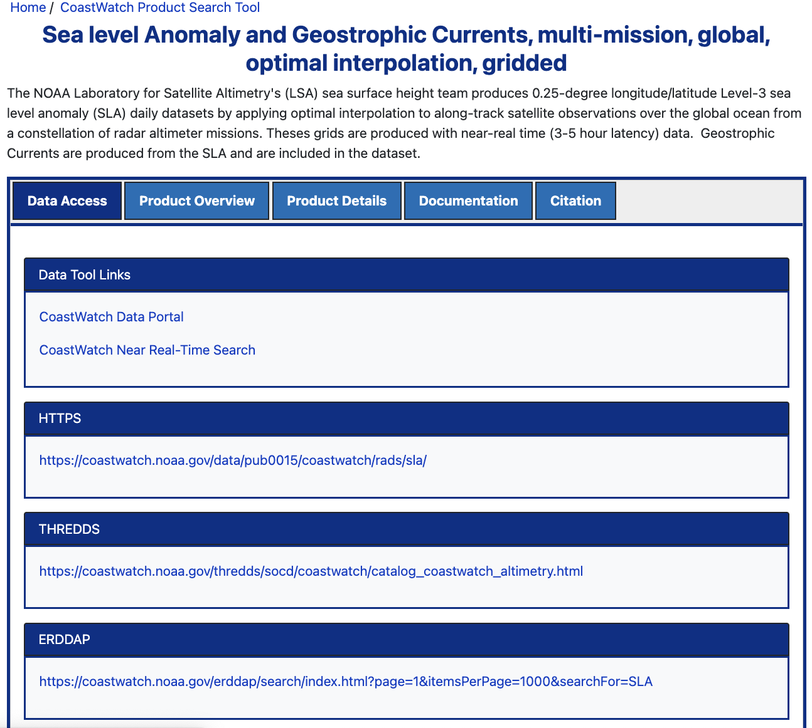

## 1. Introduction

You can download most **CoastWatch** data directly from a secure web server using **HTTPS**.

- **Get Full Files:** HTTPS is the standard web method used to download complete, original files.
- **Great for Big Tasks:** This method is ideal when you need to download a lot of data at once (for example, 10 years of daily global satellite data).
- **Full Data vs. Small Pieces:** Some servers (like ERDDAP or THREDDS) let you cut out and download just a small slice of a dataset. HTTPS is different—it is best when you want the whole, raw file.

------------------------------------------------------------------------

### What You Will Learn

In this tutorial, you will learn how to:

1.  **Find files:** Explore the folder structure of a web server to find the files you need.
2.  **Download one file:** Use R to automatically save a single file to your computer.
3.  **Download many files:** Use an R script to download multiple files automatically.

> **Tip:** While this guide uses CoastWatch data as an example, you can use these same R steps to download files from other HTTPS web servers.

## 2. Environment Requirements:

- R Version: 4.6.0+
- Dependencies: rvest, curl

The `curl` package is not required to run the main tutorial, but is required to run the example in the [Appendix].

### Library installation examples for running in a code block

```{r}
#install.packages(c(
#  "rvest",
#  "curl"
#))

```

```{r}
# Load necessary packages
library(rvest)
library(curl)
```

## 3. Dataset for This Tutorial

We’ll use the CoastWatch **Sea Level Anomaly and Geostrophic Currents** datasets for the examples in this tutorial.

- **First Step**: Open the [dataset documentation page](https://coastwatch.noaa.gov/cwn/products/sea-level-anomaly-and-geostrophic-currents-multi-mission-global-optimal-interpolation.html).

  - <https://coastwatch.noaa.gov/cwn/products/sea-level-anomaly-and-geostrophic-currents-multi-mission-global-optimal-interpolation.html>

- The dataset documentation page gives you access to the product overview, details, and citations.

- The "Data Access" tab points you to all of the ways to download and visualize the the data from the dataset.



### 3.1. Exploring the HTTPS Directory

1.  On the "Data Access" tab on the documentation page, scroll down and click the **HTTPS** link.
    - The folders are organized by year (from 2015 to the present).
    - Note that other datasets might use different setups, like sorting by month or region.
2.  Open the **2024** folder. Inside, you will see a long list of data files.

### 3.2. File naming conventions:

The files in this dataset follow a strict naming pattern:\
\> `rads_global_nrt_sla_20240119_20240120_001.nc`

Here is what each piece of the name means:

- **rads:** Radar Altimeter Database System (the system used to gather data).
- **global:** Covers the entire global ocean.
- **nrt:** Near Real-Time data (collected quickly).
- **sla:** Sea Level Anomaly dataset.
- **20240119:** The date the data was collected (January 19, 2024).
- **20240120:** The date the file was processed (January 20, 2024).

> **Note:** Different CoastWatch datasets use different naming styles. Always check the documentation for the specific data you are using.

### 3.3. Get the File Link for the R Example

We will look for the file from January 19, 2024: `rads_global_nrt_sla_20240119_20240120_001.nc`

- If you click the file name in your browser, it downloads normally to your computer.
- **Instead, we want to download it automatically using R**
- Right-click the file name and choose **"Copy link address"** to get its web path.

The full web path looks like this: [https://www.star.nesdis.noaa.gov/data/pub0015/coastwatch/rads/sla/2024/ rads_global_nrt_sla_20240119_20240120_001.nc](https://www.star.nesdis.noaa.gov/data/pub0015/coastwatch/rads/sla/2024/rads_global_nrt_sla_20240119_20240120_001.nc)

#### Put the URL into a variable called **download_url**, as shown.

We use paste0() here simply to make the URL easier to read across multiple lines. It produces the same result as writing the entire URL as one long string.

```{r}
download_url <- paste0(
  "https://www.star.nesdis.noaa.gov/data/pub0015/",
  "coastwatch/rads/sla/2024/",
  "rads_global_nrt_sla_20240119_20240120_001.nc"
)

```

## 4. Single File Downloads with R

### 4.1 Download Helper Function

Let's build a helper function to simplify downloading files from an HTTPS server using **base R**. This function includes several useful features:

- **Base R Implementation:** It uses R's built-in `download.file()` function, so no additional packages are required for downloading files.
- **Safe Filename Extraction:** It uses `basename()` to extract only the filename from the URL, preventing directory paths in the URL from affecting where the file is saved.
- **Automatic Directory Creation:** It creates the output directory (and any missing parent folders) before downloading the file.
- **Configurable Timeout:** It allows you to specify how long R should wait for a response before stopping the download, helping prevent the script from hanging indefinitely.
- **Portable File Paths:** It uses `file.path()` to construct file paths, ensuring the code works correctly across Windows, macOS, and Linux.
- **Returned Output Path:** It returns the full path to the downloaded file so it can be reused in later steps of your workflow.

> **Alternative Approach:** You can also download files using the `curl` package, which provides additional features for handling network transfers. We demonstrate this approach in the [Appendix].

### R Helper Function to download files

```{r}
download_file_with_r <- function(
    url,
    output_dir,
    timeout = 30
) {

    # Extract filename from URL
    filename <- basename(url)

    if (filename == "") {
        stop("URL does not contain a valid filename.")
    }

    # Ensure output directory exists
    dir.create(output_dir, recursive = TRUE, showWarnings = FALSE)

    # Full path to save the file
    output_path <- file.path(output_dir, filename)

    # Save the current timeout so it can be restored
    old_timeout <- getOption("timeout")
    on.exit(options(timeout = old_timeout), add = TRUE)

    # Set timeout (seconds)
    options(timeout = timeout)

    # Download the file
    download.file(
        url = url,
        destfile = output_path,
        mode = "wb",
        quiet = FALSE
    )

    output_path
}

```

### 4.2 Usage example

#### The function takes three arguments

> download_file_with_r(url, output_dir: str, timeout)

- **url (str)**: The HTTPS URL of the file to download.
- **output_dir (str)**: The local directory where the file will be saved.
- **timeout (optional, int)**: The maximum number of seconds R will wait for the download before stopping. The default is 30 seconds.

#### The function returns the full download path

We will use the default timeout, adding:

1.  HTTPS URL of the file to download.
2.  The download directory.

```{r}
# Download the file
saved_file <- download_file_with_r(
    download_url,
    file.path(
        "downloads",
        "sea_level_anom",
        "2024"
    ),
    timeout = 30
)

# Display the full path to the downloaded file
print(saved_file)

```

## 5. Bulk Downloads

We can take advantage of **consistent web links** and **file names** to download large sets of data automatically.

For this **Sea Level Anomaly and Geostrophic Currents** dataset:

- **Web Links Follow This Setup:**

> `www.star.nesdis.noaa.gov/data/pub0015/coastwatch/rads/sla/YYYY/` *(Where **YYYY** is the four-digit year you want to download).*

- **File Names Follow This Setup:**

> `rads_global_nrt_sla_20240119_20240120_001.nc` *(Where **20240119** is the exact date the data was collected, written as YYYYMMDD for January 19, 2024).*

### 5.1 Task Scenario

Our goal is to download all **June** data files (`.nc` format) for the years **2022 and 2023** from the CoastWatch HTTPS server.

**Step-by-Step Workflow:**

1.  **Find file links:** Write a helper function (`scrape_http_files`) that reads an HTTPS directory listing and collects the `.nc` file links for a specific year.
2.  **Retrieve the yearly file list:** Run this function on each year's directory to collect the available file links before filtering them.
3.  **Filter for June:** Keep only the files whose names contain `YYYY06`, indicating they were collected in June.
4.  **Download the data:** Save the filtered June files directly to a folder on your computer using our `download_file_with_r()` helper function.

### 5.2. Helper Function to Collect File Links

To automatically collect file links from an HTTPS directory, we will create a helper function that takes two simple arguments:

1.  **url:** The web address of the directory we want to search.
2.  **file_ext (optional):** The file extension to keep (such as `.nc`). If omitted, the function returns links to all files in the directory.
3.  **timeout:** How many seconds R should wait for the website to respond before giving up. The default is 30 seconds.

The function automatically reads the directory listing, removes navigation links and subdirectories, filters the results by file extension (if specified), and returns a **sorted list of complete file URLs** ready for downloading.

```{r}
scrape_http_files <- function(
    url,
    file_ext = NULL,
    timeout = 30
) {

    # Ensure URL ends with a slash
    if (!grepl("/$", url)) {
        url <- paste0(url, "/")
    }

    # Save current timeout and restore it when finished
    old_timeout <- getOption("timeout")
    on.exit(options(timeout = old_timeout), add = TRUE)

    # Set timeout (seconds)
    options(timeout = timeout)

    # Read the directory listing page
    page <- rvest::read_html(url)

    # Extract all hyperlink targets
    hrefs <- page |>
        rvest::html_elements("a") |>
        rvest::html_attr("href")

    # Remove directories and navigation links
    files <- hrefs[
        !is.na(hrefs) &
        !grepl("/$", hrefs) &
        !grepl("^\\?|^/|^\\.\\./", hrefs)
    ]

    # Filter by extension if requested
    if (!is.null(file_ext)) {

        if (is.character(file_ext) && length(file_ext) == 1) {
            file_ext <- c(file_ext)
        }

        pattern <- paste0(
            "(",
            paste(gsub("\\.", "\\\\.", file_ext), collapse = "|"),
            ")$"
        )

        files <- files[
            grepl(pattern, files, ignore.case = TRUE)
        ]
    }

    # Return full URLs
    sort(paste0(url, files))
}

```

### 5.3 Complete Workflow

#### Bulk Download of June netCDF Files (2022–2023)

The workflow below combines the two helper functions (`download_file_with_r()` & `scrape_http_files()`) developed earlier to automate downloading multiple files from the CoastWatch HTTPS server.

For each requested year, the code retrieves a list of available NetCDF file URLs using `scrape_http_files()`. It then filters that list for files collected during the selected month (YYYYMM) and downloads each matching file using `download_file_with_r()`. Downloaded files are organized into year and month folders.

For demonstration purposes, this example includes a `break` statement so that only the first matching file from each year is downloaded.

- **Note**: Without the `break`, the workflow would download every June file for both **2022** and **2023** (about **60 daily NetCDF files**), which can take several minutes. Once you've confirmed the workflow is working correctly, remove or comment out the `break` statement to download every matching file.

```{r}
# Years to download data for
years <- c(2022, 2023)

# Months to download (June)
months <- c(6)

# Loop through each year
for (year in years) {

  # HTTPS directory for the current year
  url_path <- paste0(
    "https://www.star.nesdis.noaa.gov/data/pub0015/",
    "coastwatch/rads/sla/",
    year,
    "/"
  )

  # Get all NetCDF file URLs for the year
  files_for_year <- scrape_http_files(
    url_path,
    file_ext = ".nc",
    timeout = 30
  )

  # Loop through each selected month
  for (month in months) {

    # Format month as two digits (e.g., 06)
    month_str <- sprintf("%02d", month)

    # Pattern used to identify files for this year/month
    search_pattern <- paste0(
      "rads_global_nrt_sla_",
      year,
      month_str
    )

    # Keep only files matching the year/month
    files_for_month <- grep(
      search_pattern,
      files_for_year,
      value = TRUE
    )

    # Download matching files
    for (file_to_get in files_for_month) {

      # Output directory for downloaded files
      out_dir <- file.path(
        "downloads",
        "sea_level_anom",
        year,
        month_str
      )

      # Display file being downloaded
      cat("Downloading:", file_to_get, "\n")

      # Download the file
      saved_file <- download_file_with_r(
        file_to_get,
        out_dir
      )

      # Display saved file path
      cat("File saved to:", saved_file, "\n")

      # Stop after the first file for testing
      # Remove this break to download all files
      cat("Comment out break to download all files\n")
      break
    }
  }
}

```

## 6. Things to Keep in Mind

- HTTPS directory structures vary between datasets (by year, month, region, etc.).
- File naming conventions also vary — check documentation before automating.
- Directory listings may include files for multiple product types (SST, Chlorophyll...).
  - You may need to filter for the desired product.
- Consider filtering by extension (.nc) to avoid downloading unwanted file types.

## 7. Assignments

### Task 1

Your task is to download the file for the **1st and 16th day of each month** between **2019 and 2025**, using a different dataset from the CoastWatch HTTPS directory. Organize the downloaded files into subdirectories by year inside a top-level folder named **geopolar**.

We’ll use:

#### Dataset: NOAA Geo-Polar Blended Global Sea Surface Temperature Analysis

This dataset combines sea surface temperature (SST) observations from multiple **polar-orbiting** and **geostationary satellites**, producing a global SST product at **0.05° (\~5 km) resolution**.

#### Instructions

1.  Open the [dataset documentation page](https://coastwatch.noaa.gov/cwn/products/noaa-geo-polar-blended-global-sea-surface-temperature-analysis-level-4.html).
2.  Scroll down to the HTTPS section.
3.  Click the Day + Night link to access the data directory.
4.  Write R code to:
    - Scrape the available files,
    - Select the files corresponding to the 16th of each month,
    - Download them into a directory structure like:

💡 Hint: You can adapt the scraping and downloading functions developed in the previous sections.

**Good luck, and have fun using your new data access skills!**

## Appendix

### Using the curl package to download

You must have the `curl` package installed on your system for this function to work. Unlike download.file(), curl::curl_download() provides additional networking features and may offer improved performance for some download workflows.

```{r}
library(curl)

download_file_with_curl <- function(url, output_dir) {

  # Extract filename from URL
  filename <- basename(url)

  if (filename == "") {
    stop("URL does not contain a valid filename.")
  }

  # Ensure output directory exists
  dir.create(output_dir, recursive = TRUE, showWarnings = FALSE)

  # Full path to save the file
  output_path <- file.path(output_dir, filename)

  # Download the file
  curl::curl_download(
    url = url,
    destfile = output_path
  )

  return(output_path)
}

```

### Usage example

```{r}
# Download using the curl package
saved_file <- download_file_with_curl(
  download_url,
  file.path("downloads", "sea_level_anom", "2024")
)

print(saved_file)

```
