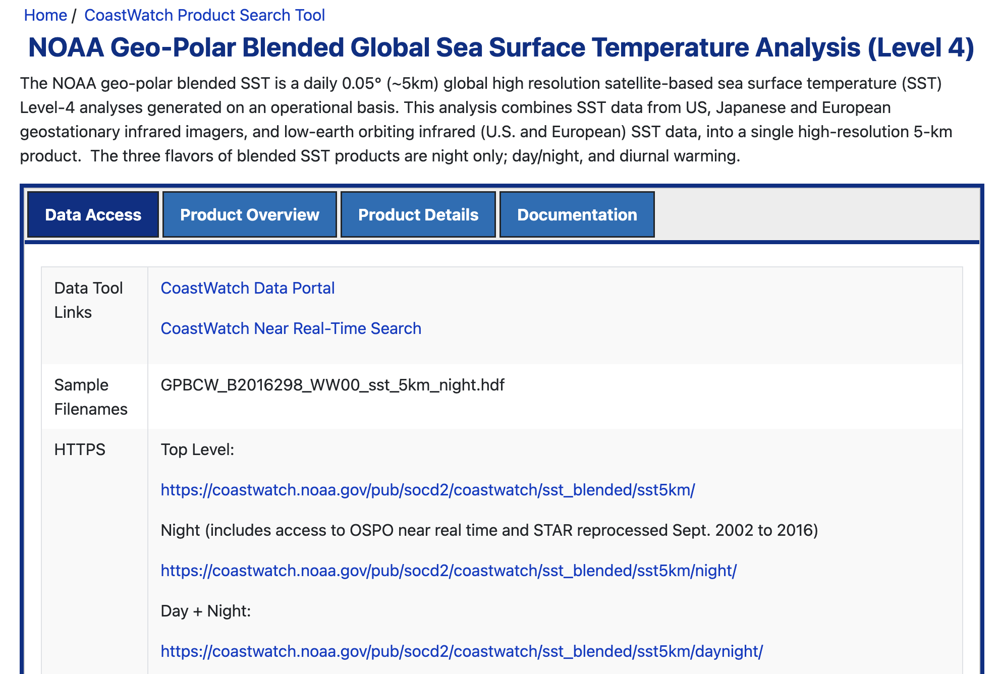
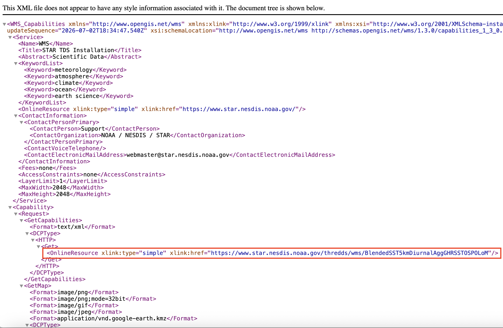

## Introduction

Most CoastWatch **THREDDS (Thematic Real-time Environmental Distributed Data Services)** servers also provide access through a **Web Map Service (WMS)**.

- A **WMS** streams **pre-rendered satellite imagery** directly into mapping applications.
- Unlike **OPeNDAP**, which returns the underlying scientific data, **WMS** returns rendered map images that are ready to display.
- As users pan and zoom around the map, Leaflet automatically requests only the imagery needed for the current view, making WMS an efficient option for interactive web maps.
- WMS layers can be customized by selecting different color palettes, value ranges, and display options without downloading the original dataset.

In this tutorial, we will learn **R methods to stream CoastWatch satellite imagery from a THREDDS Web Map Service (WMS)** and display it in an interactive Leaflet map.

> **Note:** While this guide uses CoastWatch data as an example, you can use these same R steps with other THREDDS WMS services that support the OGC Web Map Service standard.

------------------------------------------------------------------------

### What You Will Learn

In this tutorial, you will learn how to:

1.  **Find a WMS endpoint:** Locate a THREDDS WMS service for a CoastWatch dataset.
2.  **Create an interactive map:** Display satellite imagery in an interactive Leaflet map using R.
3.  **Customize the WMS layer:** Modify the color palette, value range, and rendering options.
4.  **Overlay additional data:** Add cruise station locations as interactive map markers.
5.  **Add a legend:** Display a WMS-generated legend to help interpret the satellite imagery.

## Environment Requirements:

- R Version: 4.6.0+
- Dependencies: leaflet, htmltools

### Library installation examples for running in a code block

```{r}
# install.packages(c(
#   "leaflet",
#   "htmltools"
# ))

```

## Dataset for this tutorial

This tutorial uses the **NOAA Geo-Polar Blended Global Sea Surface Temperature Analysis (Level 4)** dataset.

This product combines observations from multiple polar-orbiting and geostationary satellites to produce a gap-filled, daily global sea surface temperature analysis at approximately 5 km spatial resolution.

Open the dataset documentation page:

- <https://coastwatch.noaa.gov/cwn/products/noaa-geo-polar-blended-global-sea-surface-temperature-analysis-level-4.html>



## Where to find the data

CoastWatch datasets provide several access methods, including HTTPS, THREDDS, and ERDDAP. Since this tutorial focuses on Web Map Services, we will use the THREDDS server.

From the dataset documentation page:

1.  Scroll down to the **THREDDS** access section.


2.  Open the **Polar plus Geostationary Multisatellite Blended SST – Diurnal Operational OSPO – Geographic Projection (Aggregated View)** dataset.


3.  Select **Entire Collection (Aggregated View)**.

The aggregated view allows a single WMS endpoint to access the complete time series instead of working with individual daily files.


4.  Click the **WMS** link.


5.  The WMS capabilities document will open in your browser.

Copy the WMS endpoint URL shown in the browser address bar. This URL will be used by Leaflet to request imagery from the WMS server.



## Accessing the WMS data

First, load the packages used in this tutorial.

```{r}
# Install necessary packages
library(leaflet)
library(htmltools)

```

Next, define the WMS endpoint and specify how the satellite layer should be rendered.

This section defines:

- the WMS endpoint URL
- the satellite variable to display
- the WMS color palette
- the color scale used to render the imagery

### Understanding the color range

One important detail is that the **analysed_sst** variable is stored internally in **Kelvin**, even though sea surface temperature is typically interpreted in **degrees Celsius**.

Because the THREDDS WMS server expects the color scale in the variable's native units, the `COLORSCALERANGE` parameter must also be specified in Kelvin.

For example:

| Celsius |   Kelvin |
|--------:|---------:|
|    0 °C | 273.15 K |
|   32 °C | 305.15 K |

The WMS legend displayed later in this tutorial is generated directly by the server and reflects the selected color palette and rendering style.

### Choosing a color palette

The WMS server supports multiple color palettes that control how the satellite imagery is rendered. To view the available palettes for a variable, open the WMS capabilities (XML) document and search for the **Style** elements associated with that layer. Each available palette appears as a `boxfill/<palette_name>` style (for example, `boxfill/alg`, `boxfill/sst_36`, or `boxfill/rainbow`).

The legend provided by the WMS server automatically updates to match the selected palette, so no additional changes are needed when you choose a different style.

```{r}
# WMS endpoint
wms_url <- "https://www.star.nesdis.noaa.gov/thredds/wms/BlendedSST5kmDiurnalAggGHRSSTOSPOLoM"

# SST variable
sst_layer <- "analysed_sst"

# Color bar palette
palette <- "alg"
color_range <- "273,305"

# WMS Legend
legend_url <- paste0(
  wms_url,
  "?SERVICE=WMS",
  "&REQUEST=GetLegendGraphic",
  "&VERSION=1.3.0",
  "&FORMAT=image/png",
  "&LAYER=", sst_layer,
  "&STYLE=boxfill/", palette,
  "&COLORSCALERANGE=", color_range
)

```

## Cruise stations off of Monterey Bay

Next, create a small set of example cruise stations.

These locations are used to demonstrate how in-situ observations can be displayed alongside satellite imagery. In practice, these coordinates could come from ship observations, gliders, buoys, autonomous vehicles, or other field measurements.

Each point will be added to the interactive map and displayed with a popup containing its location information.

```{r}
cruise_points <- data.frame(
  station = c(
    "Station 1",
    "Station 2",
    "Station 3"
  ),
  lon = c(
    -122.10,
    -122.35,
    -122.60
  ),
  lat = c(
    36.85,
    36.65,
    36.45
  )
)

```

## Create the interactive map

Finally, combine the WMS imagery and cruise stations into a single interactive Leaflet map. We will be looking at sea surface temperature (SST) on **July 1, 2024**.

This example demonstrates several common Leaflet features:

- a CartoDB basemap
- streamed WMS satellite imagery
- cruise station markers
- popup information
- layer controls
- a WMS-generated legend (units are in Kelvin)

Notice that the sea surface temperature imagery is **not downloaded locally**. Instead, Leaflet requests map tiles directly from the THREDDS WMS server as you pan and zoom around the map.

The legend is also requested directly from the WMS server using a standard **GetLegendGraphic** request. Because it is generated by the server, its appearance—including the displayed units and layout—is determined by the WMS implementation. Some servers may truncate portions of the legend text (such as the variable name or unit label), but the color bar and value range remain unchanged and accurately represent the displayed imagery.

```{r}
leaflet() |>
  addProviderTiles(
    providers$CartoDB.Positron,
    group="Basemap"
  ) |>
  setView(
    lng=-122.3,
    lat=36.7,
    zoom=6
  ) |>
  addWMSTiles(
    baseUrl=wms_url,
    layers=sst_layer,
    options=WMSTileOptions(
      format="image/png",
      transparent=TRUE,
      version="1.3.0",
      styles=paste0("boxfill/", palette),
      colorscalerange=color_range,
      logarithmic=FALSE,
      time="2024-07-01T12:00:00.000Z"
    ),
    attribution="NOAA CoastWatch",
    group="Sea Surface Temperature"
  ) |>
  addCircleMarkers(
    data=cruise_points,
    lng=~lon,
    lat=~lat,
    radius=6,
    color="#0057e7",
    weight=2,
    fillColor="#4da6ff",
    fillOpacity=1,
    popup=~paste0(
      "<b>",station,"</b><br>",
      "Latitude: ",lat,"<br>",
      "Longitude: ",lon
    ),
    group="Cruise Stations"
  ) |>
  addLayersControl(
    overlayGroups=c(
      "Sea Surface Temperature",
      "Cruise Stations"
    ),
    options=layersControlOptions(collapsed=FALSE)
  ) |>
  # WMS Legend
  addControl(
    html = HTML(
      paste0(
        ""
      )
    ),
    position = "topright"
  )

```

## Summary

In this tutorial, you learned how to:

- Locate a WMS endpoint from a CoastWatch THREDDS server.
- Stream satellite imagery directly into a Leaflet map.
- Overlay in situ cruise stations on top of satellite data.
- Customize the appearance of a WMS layer using palettes and color ranges.
- Add the WMS-generated legend to improve map interpretation.

Because WMS streams pre-rendered imagery rather than downloading the underlying dataset, it is particularly well suited for interactive visualization applications and web-based dashboards.
