# ArcGIS Tutorial 1 (ArcGIS Pro)

This tutorial is updated from the ArcMap version and will teach you how to import NetCDF data into ArcGIS ArcPro, extract environmental values at survey locations, or within polygons. Finally, you'll learn how to create a habitat map based on a range of SST values.

You will need the **spatial analyst** extension to complete this tutorial.

## Introduction

ESRI ArcGIS Pro is a program with an intuitive graphic user interface. Once you are familiar with the general structure of the program, it is easy to navigate. The trade-off is that it can be very slow. Please be aware that you might need patience if working with large datasets.

In Esri’s world, data with x (long), y (lat) and time dimensions, like ocean satellite data, are called **multidimensional data**. Depending on how the data are organized, some functions may or may not be available and processing of the data may take a long time. (R is a great alternative for large datasets!)

### 1. Licensing of ArcGIS Pro

Check the licensing to ensure spatial analyst is available  

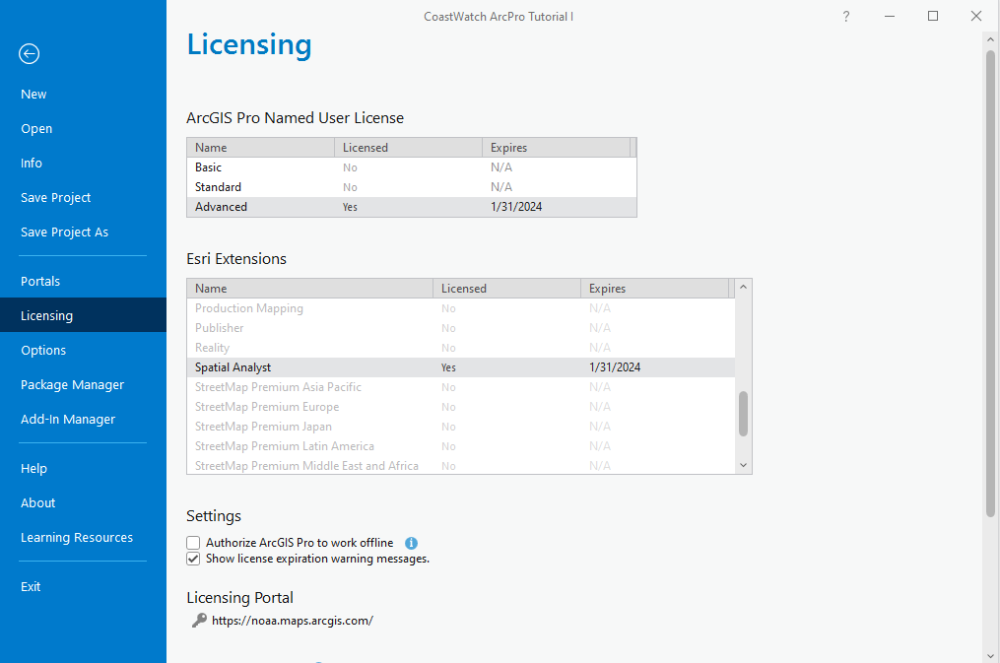

The layout of ArcGIS Pro is slightly different from ArcMap, as the tool icons are categorized by menu selection (Map, Insert, Analysis, etc)

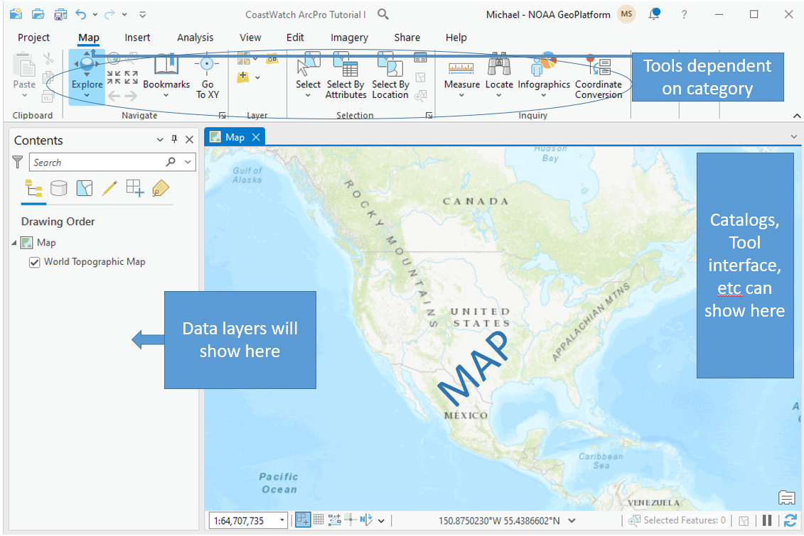

### 2. Download NetCDF data from ERDDAP

Let's download some monthly Sea Surface Temperature (SST) data to work with. In this example, we will download data as a NetCDF dataset where each variable is a time slice of monthly data. Our NetCDF satellite data are typically pixel or cell values and considered to be a raster dataset.

In a browser, open https://oceanwatch.pifsc.noaa.gov/erddap/griddap/CRW_sst_v3_1_monthly.html  

Adjust the time sliders for the desired temporal coverage. Make sure to select a reasonable subset in time and space (see example below). The amount of data that can be directly downloaded from ERDDAP is limited. Downloading a reasonable amount of data will also help the processing time in ArcGIS. Because of the download and processing limits, it is not recommended to work with a long time-series in ArcGIS (for example, 365 days of daily chl-a, or 20 years of monthly composite of sst).

To obtain a NetCDF file, change the File type to “.nc – Download a NetCDF-3 binary file with COARD/CF/ACDD metadata”.

Once the settings are entered, click on the Submit button to download. ERDDAP will then generate the output dataset from the appropriate input files on the server.

Save the downloaded file on your computer.

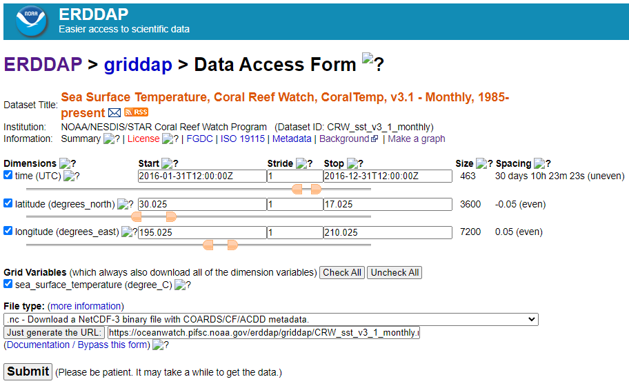

### 3. Add data into ArcGIS Pro

We can now add the data to our ArcGIS Pro map. Recall, the NetCDF contains multiple dimensions -- time slices (t) of geographic (x,y) data. Follow these steps to add the data and maintain the dimensions of the dataset:

- Use the Add Data icon 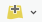 to select 'Multidimensional Raster data'  
- Select 'Import Variables from Multidimensional Raster' and navigate to your input data (NetCDF file)  
- Select the sea surface temperature (and it should show time steps in the description)  

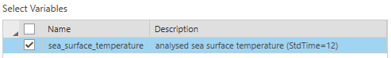

- Output Configuration set to 'Multidimensional Raster'  
- Click OK  

When the data loads, it should display on the map with a time slider at the top. This is automatic compared to prior versions of ArcMap:

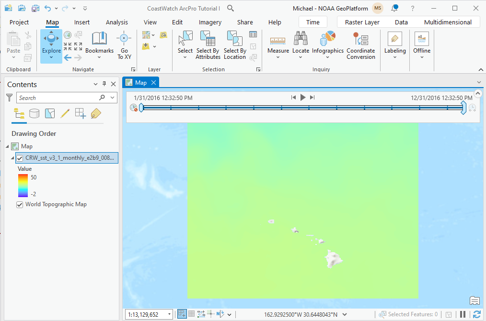

However, to access all slices, the time dimension must be configured properly. Open the layer properties and follow these steps:

1. Click Calculate if the Time Extent is not populated  
2. Adjust the time interval to 'view using unique times within the data'  
3. Set the time zone to UTC  
4. Click Ok when done  

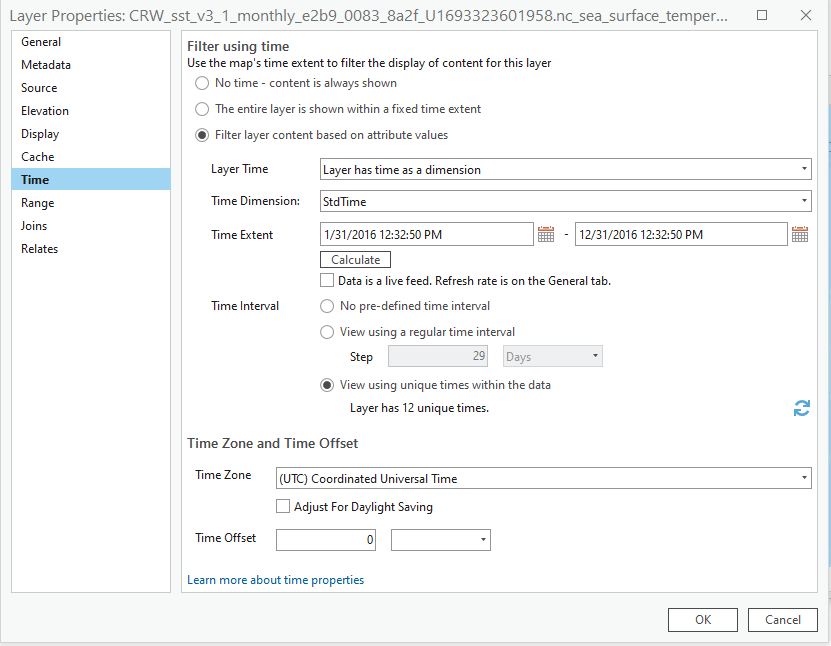

The data's timesteps should now be synchronized with the steps within the time slider. Pressing the 'play' icon on the time slider will step through each monthly dataset (or time-slice within the NetCDF file).

Note, ArcGIS Pro can easily lose track of the multidimensional data source. You'll know this has happened if a red exclamation point shows on your data layer. You can avoid this by converting the layer to a CRF (Esri's Cloud Raster Format). Use <right-click>-Layer, select Data->Export, check the multidimensional box and click the Export button. This format will be directly compatible across the ArcGIS platform, retain the multidimensionality, and more efficient if saved with the 'transpose' option checked. See more about this format at  
https://pro.arcgis.com/en/pro-app/latest/help/data/imagery/an-overview-of-multidimensional-raster-data.htm

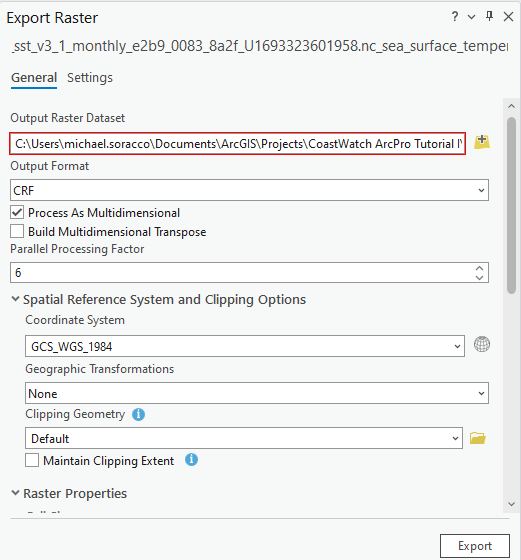

### 4. Create a map

Let's add some additional data to the map. This is for familiarization, so do not worry if the SST data you downloaded doesn't match the times of the fish survey data that will be added to the map.

Download the https://oceanwatch.pifsc.noaa.gov/files/esd_fish_survey_2016.csv file and save to your working folder. The data are comma-separated-values and organized in a data table similar to a spreadsheet.

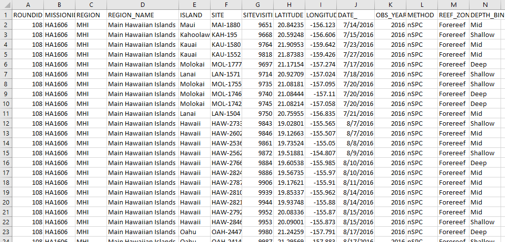

Because the data include geographic coordinates (Latitiude and Longitude), we can add these data directly to our map.

- Use the Add Data icon  to select the CSV file. The table will be added as a Standalone Table.  
- Locate the esd_fish_survey_2016 table dataset in the Content Pane and right-click the layer and select “Display XY Data”

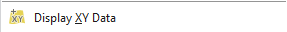

- In the “Display XY Data” window, choose LONGITUDE as the X Field, and LATITUDE as the Y Field.  
- system for the displayed map.  
- The XY layer is then added to the geospatial data in the Contents Pane. Note, if you want to save it independently of your project, you will have to export it by right-clicking the esd_fish_survey_2016.csv Events layer and then Data > Export Data  
- Right-click the exported feature data, and click “Zoom to Layer”  

The fish survey data are now displayed along with the SST.

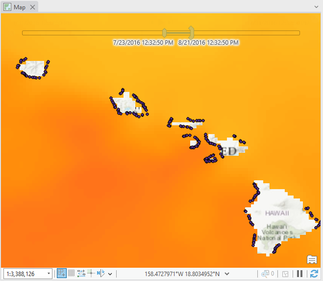

**If you already know how to create a layout map, you can skip this part of the tutorial.**

Let's touch up our map display by creating a Layout. A Layout allows you to embed the map frame and then add other map elements such as grid, North arrow, scale, and more.

- On the top menu, click Insert > New Layout  
- On the top menu, click Insert > Map and select the icon with your SST data  
- Continue inserting elements (scale, North arrow, legend).  

You finished map may look like:

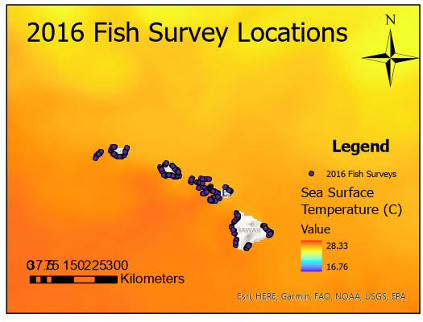

You can export the map as a PDF by clicking "File" in the top menu and "Export Map".  
Choose PDF for “Save as type” and save the map on your computer.  
To save the map you created, click on the Save button (floppy disk button) and save the project as “sst_netcdf_map.mxd” on your computer.

Links to an external site.

### 5. Calculate statistics within polygons

Let’s calculate some summary statistics of SST within a shapefile. First, you will need to download the [3 nautical mile boundary shapefile](http://oceanwatch.pifsc.noaa.gov/files/3_naut_mile_bndry.zip) Save the file to your working directory, and unzip the shapefile.

The “Zonal Statistics as Table” tool from the Spatial Analyst extension allows users to calculate summary statistics from raster data over a specific zone (a polygon or another raster). However, to run over all the timesteps in the Sea Surface Temperature (NetCDF) layer, you must select 'Process as multidimensional.'

- Add the 3_naut_mile_bndry_wgs84.shp to the table of contents. Using this shapefile, we will compute statistics of SST within the 3 nautical mile boundary, for each island.  
- To make sure the layers display properly, you can manually change the order of the layers. Click the top left icon in the Contents: “List by drawing order”. Then click-and-drag the 3_naut_mile_bndry_wgs84.shp layer above the Sea Surface Temperature layer in Contents Drawing Order.  

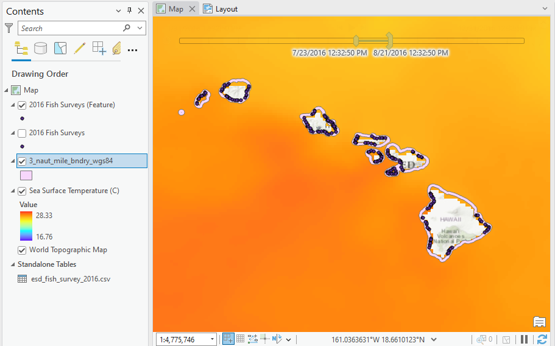

- Right-click on the 3_naut_mile_bndry_wgs84.shp shapefile in the table of contents, and Open Attribute Table  
- Notice that there are 8 records, with each record corresponding to a polygon, for each island.  
- Use the Feature Analysis tool 'Zonal Statistics by Table' (or via the Toolbox within the Image or Spatial Analyst Extension)  

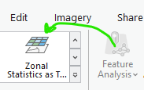

- Click the “Zonal Statistics as Table” tool.  
- Enter the parameters as follows:  
  - Input Raster: Sea Surface Temperature  
  - Zone Polygon: 3_naut_mile_bndry_wgs84.shp  
  - Zone Polygon Id: ISLAND  
- Output Workspace: your working folder or create a new folder for output data  
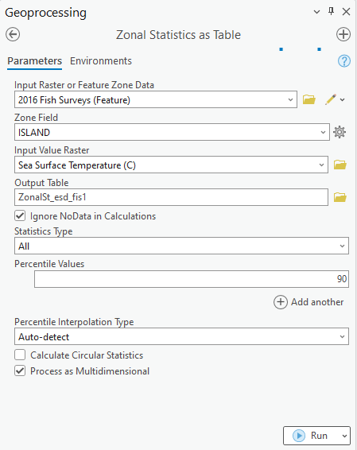

- Click OK to run the tool  
- The table will be added to your Contents. Note the statistics are evaluated by island for each time step. Here the table is sorted by Name:  

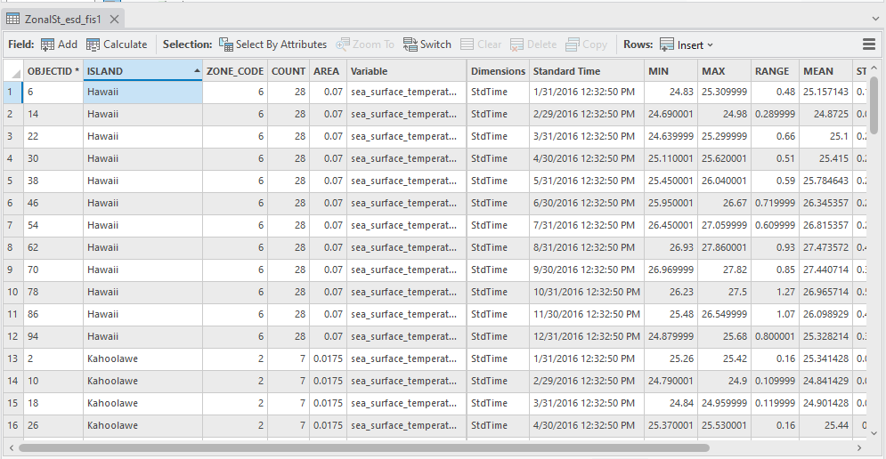
