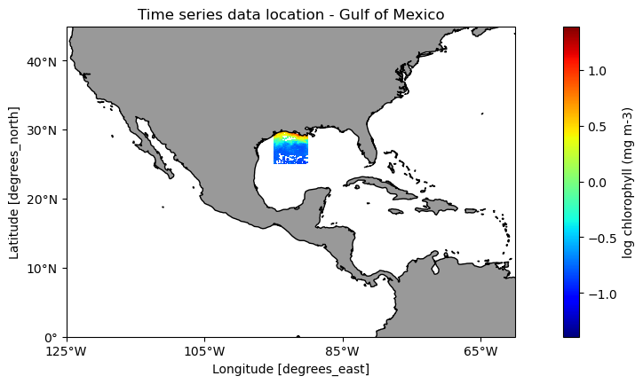
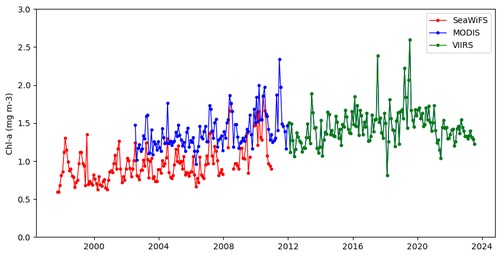
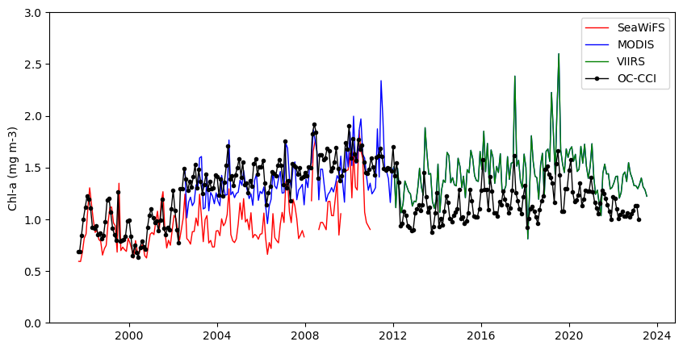

---
execute:
  eval: false
jupyter: python3
---

<p style="font-size:14px; text-align: right">CoastWatch Python Exercises</p>  

# Tutorial 2. Compare time series from different sensors
> History | Updated August 2023

## Background
Several ocean color sensors have been launched since 1997 to provide continuous global coverage for ocean color data. The sensors have differences in design and calibration, and different algorithms may be applied to generate chlorophyll values. Consequently, chlorophyll-a values can vary among the sensors during periods where measurements overlap. 

To examine this phenomenon, we will download and plot a time series of chlorophyll-a concentrations from various sensors that collected data between 1997 and the present to see how the measurements compare during periods of overlap. 

## Objective
This tutorial will show how to extract a time series from four different monthly satellite chlorophyll datasets for the period that each was in operation between 1997-present. 

## The tutorial demonstrates the following techniques
* Using xarray to extract data from a rectangular area of the ocean over time
* Retrieving information about a dataset from ERDDAP
* Comparing results from different sensors
* Averaging data spatially
* Producing time-series plots
* Drawing maps with satellite data 

## Datasets used
SeaWiFS  Chlorophyll-a, V.2018, Monthly, Global, 4km, 1997-2012    
https://coastwatch.pfeg.noaa.gov/erddap/griddap/erdSW2018chlamday

MODIS Aqua, Chlorophyll-a, V.2022, Monthly, Global, 4km, 2002-present   
https://coastwatch.pfeg.noaa.gov/erddap/griddap/erdMH1chlamday_R2022SQ

NOAA VIIRS S-NPP, Chlorophyll-a, Monthly, Global, 4km, 2012-present     
https://coastwatch.noaa.gov/erddap/griddap/noaacwNPPVIIRSSQchlaMonthly

__ESA CCI Ocean Colour Dataset, v6.0, Monthly, Global, 4km, 1997-Present__   
This dataset was developed by the European Space Agency's Climate Change Initiative. The dataset merges data from multiple sensors (MERIS, MODIS, VIIRS and SeaWiFS) to create a long time series (1997 to present) with better spatial coverage than any single sensor. Parameters include chlorophyll a, remote sensing reflectance, diffuse attenuation coefficients, absorption coefficients, backscatter coefficients, and water classification.  
https://coastwatch.pfeg.noaa.gov/erddap/griddap/pmlEsaCCI60OceanColorMonthly

## Import required packages

```{python}
import xarray as xr
import numpy as np
from matplotlib import pyplot as plt
import cartopy.crs as ccrs
import cartopy.feature as cfeature
from cartopy.mpl.ticker import LongitudeFormatter, LatitudeFormatter
```

## Define the area to extract
For each dataset we will extract data for an area in the Gulf of Mexico between -95 to -90°W longitude and 25-30°N latitude.

Set up variables with the minimum and maximum values from the longitude and latitude ranges.

```{python}
lon_min = -95.
lon_max = -90.
lat_min = 25.
lat_max = 30.
```

## Get the SeaWiFS data
### Open a dataset object in xarray

```{python}
url_sw = 'https://coastwatch.pfeg.noaa.gov/erddap/griddap/erdSW2018chlamday'
sw_ds = xr.open_dataset(url_sw)
sw_ds
```

### Print out some useful metadata
You can view all of the metadata above in the dataset object. Let's print out some metadata items to point a few things out:
* The SeaWiFS dataset spans 13 years, from 1997 to 2010  
* The chlorophyll variable is called "chlorophyll". Knowing this is important because variable names are not standardized, and we will need to know the exact variable name to extract the data. 
* Checking the first and last value of latitude can tell us if the latitude values are in ascending or descending order.   

```{python}
print('earliest date =', sw_ds.time.values[0])
print('most recent date =', sw_ds.time.values[-1], '\n')
print('variable:', list(sw_ds.data_vars.keys()), '\n')

print("Is latitude's first value -->", round(sw_ds.latitude[0].item(), 6))
print('greater than') 
print("latitude's last value -->", round(sw_ds.latitude[-1].item(), 6))

print(sw_ds.latitude[0].item() > sw_ds.latitude[-1].item())

```

### Pay attention to the first and last values of latitude in the dataset
In a netCDF file that completely follows accepted standards, the latitude values are ascending; the values go from lowest to highest (south to north). Therefore, when we use the slice function (below) to subset the dataset we would list the lowest value in our subset followed by the highest.   
* slice(lat_min, lat_max)  

However, for some datasets the latitude values are in descending order, meaning the files were built with latitudes indexed from highest to lowest (north to south). It is a common occurrence and it impacts how we subset that dataset, so you need to be aware of it.  
* With latitude values in descending order, if you use "slice(lat_min, lat_max)" you will get no data, because __there are no latitude values between lat_min and lat_max__. 
* However, by reversing the order within slice by __using "slice(lat_max, lat_min)" you will get data.__  

__For the SeaWiFS dataset, the metadata above show that the first latitude value (89.958336) is greater than the last (-89.958336). The latitude values are in descending order.__    
* There are methods in xarray to flip the latitude dimension. A simpler solution is to use a logic step that determines if latitude values are descending, then set slice values to use the higher value first (see below).   

```{python}
# The lat1 and lat2 values are used in the slice function
# At first we set them as if the dataset is compliant with standards
lat1 = lat_min
lat2 = lat_max

# Then switch them if latitude values are descending
if sw_ds.latitude[0].item() > sw_ds.latitude[-1].item():
    lat1 = lat_max
    lat2 = lat_min
```

### Subset the data from the dataset object.
Note that so far we have not downloaded data. We have only set up how we want to download the data. 
* The download will happen when we request to use data, like when creating the map below. 

```{python}

sw_subset = sw_ds['chlorophyll'].sel(time=slice(sw_ds.time[0], sw_ds.time[-1]),
                                     latitude=slice(lat1, lat2),
                                     longitude=slice(lon_min, lon_max)
                                     )
sw_subset
```

### Plot data to show where it is in the world.

```{python}
plt.figure(figsize=(14, 10))

# Label axes of a Plate Carree projection with a central longitude of 180:
ax1 = plt.subplot(211, projection=ccrs.PlateCarree(central_longitude=180))

# Use the lon and lat ranges to set the extent of the map
ax1.set_extent([240, 300, 5, 45], ccrs.PlateCarree())

# Set the tick marks to be slightly inside the map extents
ax1.set_xticks(range(235, 305, 20), crs=ccrs.PlateCarree())
ax1.set_yticks(range(0, 50, 10), crs=ccrs.PlateCarree())

# Add features to the map
ax1.add_feature(cfeature.LAND, facecolor='0.6')
ax1.coastlines()

# Format the lat and lon axis labels
lon_formatter = LongitudeFormatter(zero_direction_label=True)
lat_formatter = LatitudeFormatter()
ax1.xaxis.set_major_formatter(lon_formatter)
ax1.yaxis.set_major_formatter(lat_formatter)

np.log10(sw_subset[-1]).plot.pcolormesh(ax=ax1, 
                                        transform=ccrs.PlateCarree(), 
                                        cmap='jet', 
                                        cbar_kwargs={'label': "log chlorophyll (mg m-3)"})

plt.title('Time series data location - Gulf of Mexico')
```



### Compute the monthly mean over the region

```{python}
swAVG = sw_subset.mean(dim=['latitude','longitude'])
swAVG.head()

# If you are running low on memory, uncomment the next line
# del sw_subset
```

## Get monthly MODIS data
### Repeat the steps above to get data for the MODIS Aqua chlorophyll dataset 

```{python}
url_modis = '/'.join(['https://coastwatch.pfeg.noaa.gov',
                      'erddap',
                      'griddap',
                      'erdMH1chlamday_R2022SQ'
                      ])
modis_ds = xr.open_dataset(url_modis)
modis_ds

print('earliest date =', modis_ds.time.values[0])
print('latest date =', modis_ds.time.values[-1], '\n')
print('variables:', modis_ds.data_vars.keys(), '\n')
print('Is the first latitude value -->', modis_ds.latitude[0].item())
print('greater than the last latitude value -->', modis_ds.latitude[-1].item())

print(modis_ds.latitude[0].item() > modis_ds.latitude[-1].item())

lat1 = lat_min
lat2 = lat_max

if modis_ds.latitude[0].item() > modis_ds.latitude[-1].item():
    lat1 = lat_max
    lat2 = lat_min

modis_subset = modis_ds['chlor_a'].sel(time=slice(modis_ds.time[0], modis_ds.time[-1]),
                                       latitude=slice(lat1, lat2),
                                       longitude=slice(lon_min, lon_max)
                                       )

modisAVG = modis_subset.mean(dim=['latitude', 'longitude'])

# If you are running low on memory, uncomment the next line
# del modis_subset 
```

## Get monthly VIIRS data
### Repeat the steps above to get data for the VIIRS SNPP chlorophyll dataset

```{python}
url_viirs = '/'.join(['https://coastwatch.noaa.gov',
                        'erddap',
                        'griddap',
                        'noaacwNPPVIIRSSQchlaMonthly'
                        ])
viirs_ds = xr.open_dataset(url_viirs)
viirs_ds

print('earliest date =', viirs_ds.time.values[0])
print('latest date =', viirs_ds.time.values[-1], '\n')
print('variables:', viirs_ds.data_vars.keys(), '\n')

print('Is the first latitude value -->', viirs_ds.latitude[0].item())
print('greater than the last latitude value -->', viirs_ds.latitude[-1].item())

print(viirs_ds.latitude[0].item() > viirs_ds.latitude[-1].item())

lat1 = lat_min
lat2 = lat_max

if viirs_ds.latitude[0].item() > viirs_ds.latitude[-1].item():
    lat1 = lat_max
    lat2 = lat_min

viirs_subset = modis_ds['chlor_a'].sel(time=slice(viirs_ds.time[0], viirs_ds.time[-1]),
                                       latitude=slice(lat1, lat2),
                                       longitude=slice(lon_min, lon_max)
                                       )
viirsAVG = viirs_subset.mean(dim=['latitude', 'longitude'])

# If you are running low on memory, uncomment the next line
# del viirs_subset 
```

## Plot the time series
### Plot the result for three datasets 

```{python}
plt.figure(figsize=(10, 5)) 
# Plot the SeaWiFS data
plt.plot_date(swAVG.time, swAVG, 
              'o', markersize=3, 
              label='SeaWiFS', c='red', 
              linestyle='-', linewidth=1) 

# Add MODIS data
plt.plot_date(modisAVG.time, modisAVG, 
              'o', markersize=3, 
              label='MODIS', c='blue', 
              linestyle='-', linewidth=1) 

# Add VIIRS data
plt.plot_date(viirsAVG.time, viirsAVG, 
              'o', markersize=3, 
              label='VIIRS', c='green', 
              linestyle='-', linewidth=1) 

plt.ylim([0, 3])
plt.ylabel('Chl-a (mg m-3)') 
plt.legend()
```



## Get OC-CCI data
If you needed a single time series from 1997 to present, you would have to use the plot above to devise some method to reconcile the difference in values where two datasets overlap. Alternatively, you could use the ESA OC-CCI (Ocean Color Climate Change Initiative) dataset, which blends data from many satellite missions into a single dataset, including data from SeaWiFS, MODIS, and VIIRS. 

Add the ESA OC-CCI dataset to the plot above to see how it compares with data from the individual satellite missions.  
### Repeat the steps above to get data from the ESA OC-CCI chlorophyll dataset 

```{python}
url_cci = '/'.join(['https://coastwatch.pfeg.noaa.gov',
                    'erddap',
                    'griddap',
                    'pmlEsaCCI60OceanColorMonthly'
                    ])
cci_ds = xr.open_dataset(url_cci)
cci_ds

print('earliest date =', cci_ds.time.values[0])
print('latest date =', cci_ds.time.values[-1])

# From the 93 variables in the dataset, 
# display only those with chl in the name
subset_variables = [ln for ln in list(cci_ds.data_vars.keys()) if 'chl' in ln]

print('variables with chl in name:', subset_variables, '\n')


print('Is the first latitude value -->', cci_ds.latitude[0].item())
print('greater than the last latitude value -->', cci_ds.latitude[-1].item())

print(cci_ds.latitude[0].item() > cci_ds.latitude[-1].item())

lat1 = lat_min
lat2 = lat_max

if cci_ds.latitude[0].item() > cci_ds.latitude[-1].item():
    lat1 = lat_max
    lat2 = lat_min

cci_subset = cci_ds['chlor_a'].sel(time=slice(cci_ds.time[0], cci_ds.time[-1]),
                                   latitude=slice(lat1, lat2),
                                   longitude=slice(lon_min, lon_max)
                                   )
cciAVG = cci_subset.mean(dim=['latitude', 'longitude'])

# If you are running low on memory, uncomment the next line
# del cci_subset 
```

## Replot the results using data from all four datasets 

```{python}
plt.figure(figsize=(10, 5)) 

# Add SeaWiFS data
plt.plot_date(swAVG.time, swAVG, 
              'o', markersize=0, 
              label='SeaWiFS', c='red', 
              linestyle='-', linewidth=1) 

# Add MODIS data
plt.plot_date(modisAVG.time, modisAVG, 
              's', markersize=0, 
              label='MODIS', c='blue', 
              linestyle='-', linewidth=1) 

# Add VIIRS data
plt.plot_date(viirsAVG.time, viirsAVG, 
              '^', markersize=0, 
              label='VIIRS', c='green', 
              linestyle='-', linewidth=1) 

# Add CCI data
plt.plot_date(cciAVG.time, cciAVG, 
              'o', markersize=3,
              label='OC-CCI', c='black', 
              linestyle='-', linewidth=1) 

plt.ylim([0, 3])
plt.ylabel('Chl-a (mg m-3)') 
plt.legend()
```



## References
* CoastWatch Node websites have data catalogs containing documentation and links to all the datasets available:  
    * https://oceanwatch.pifsc.noaa.gov/doc.html
    * https://coastwatch.pfeg.noaa.gov/data.html
    * https://polarwatch.noaa.gov/catalog/


