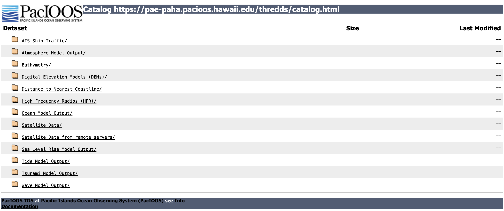
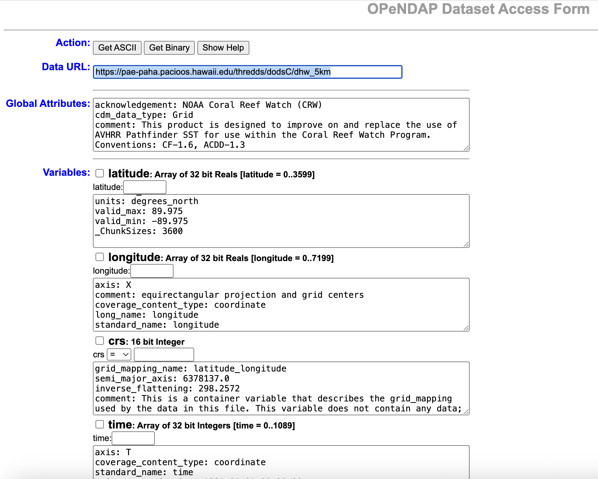

#### Author: Dale Robinson & Madison Richardson

> History | Updated July 2026


## 1. Introduction
Most CoastWatch data can also be accessed via a **THREDDS (Thematic Real-time Environmental Distributed Data Services)** server. 

* THREDDS provides a **catalog-based interface** for organizing and accessing datasets.  
* It is particularly useful for **discovering and aggregating data** (e.g., grouping daily NetCDF files into a single time series).
* Unlike HTTPS, which only delivers full files, **THREDDS** supports the **OPeNDAP (Open-source Project for a Network Data Access Protocol)**.
* **OPeNDAP** is a web service that lets users **remotely access and subset scientific data** (like NetCDF files) over the internet **without needing to download entire files**

In this tutorial, we will learn **Python methods to remotely access and subset** scientific data CoastWatch data through the THREDDS OPeNDAP service.

> **Note:** While this guide uses CoastWatch data as an example, you can use these same Python steps to download files from other THREDDS web servers.

---

### What You Will Learn

In this tutorial, you will learn how to:

1.  **Find a dataset:** Navigate the THREDDS catalog and locate an aggregated dataset.
2.  **Connect with OPeNDAP:** Open a remote NetCDF dataset directly in Python using **xarray**.
3.  **Explore the dataset:** Examine its dimensions, coordinates, variables, and metadata.
4.  **Subset the data:** Select only the variables, time period, and geographic region needed for your analysis.
5.  **Create an animation:** Using the selected variable, make a timeseries animation.
6.  **Save your results:** Write the subsetted data to a local NetCDF file for future use.

## 2. Environment Requirements:
- Python Version: 3.11+ (3.12+ recommended)
- Dependencies: xarray netcdf4 dask matplotlib pandas ipywidgets

### Library installation examples for running in a code block
* Option 1: For standard Python environments
    >!pip install --quiet xarray netcdf4 dask matplotlib pandas dask[array]

* Option 2: For Conda or Mamba environments
    >%conda install --quiet --yes -c conda-forge xarray netcdf4 dask matplotlib pandas
    >Or
    >%mamba install --quiet --yes -c conda-forge xarray netcdf4 dask matplotlib pandas

## 3. Dataset for This Tutorial
We will work with:
  
**Sea Level Anomaly and Geostrophic Currents, multi-mission, global, optimal interpolation, gridded**

* Open the [dataset documentation page](https://coastwatch.noaa.gov/cwn/products/sea-level-anomaly-and-geostrophic-currents-multi-mission-global-optimal-interpolation.html). 

* The dataset documentation page provides product information, documentation, citations, and multiple ways to access the data.

   

## 4. Understanding THREDDS Access
The THREDDS server provides multiple ways to access and organize this dataset. For this tutorial, we will be focusing on accessing datasets through Aggregated View. 

If you are interested in accessing datasets through Per-file View go to the [Appendix A](#appendix-a). If you are interested in accessing datasets from another THREDDS server, go to [Appenix B](#appendix-b)

### 4.1 Aggregated Datasets
**Aggregated View** 

1. From the dataset documentation page, scroll down and click the **THREDDS** link. 
2. Choose **Geographic Projection (Aggregated View)**.
3. This representation groups daily files into larger aggregates, making it easier to work with extended time periods.

* **Yearly Aggregation** – e.g., 2024 (Aggregated View): all daily data for a year.
* **Life of Mission (Aggregated View)** – all data from 2017 to present in a single collection.

### 4.2 OPeNDAP (DODS) Access

Ultimately, we will use OPeNDAP (DODS) to programmatically access and subset the data.

1. Return to the Catalog Page for Life of Mission (Aggregated View).
2. Click OPeNDAP (DODS) to open the OPeNDAP Dataset Access Form, which displays dataset metadata.  

 

3. Copy the link shown next to Data URL — this is the OPeNDAP endpoint.
> opendap_url = [https://www.star.nesdis.noaa.gov/thredds/dodsC/AltimetryBlendedAggGlobalLoM](https://www.star.nesdis.noaa.gov/thredds/dodsC/AltimetryBlendedAggGlobalLoM)

4. The OPeNDAP endpoint can be used directly in many tools for remote access:
* Python: e.g. xarray.open_dataset(opendap_url)
* R: e.g. ncdf4::nc_open(opendap_url)
* Panoply: File > Open Remote Dataset > enter opendap_url

✅ **Key Point**: The aggregated OPeNDAP endpoint provides seamless access to the full time series without having to download or manage individual daily files.

## 5. Accessing Data with the Python xarray library
### 5.1 Open the dataset with with xarray using the OPeNDAP endpoint 
The basic code below will open the OpenDAP dataset, but it lacks a few helpful features

```python
import xarray as xr

# The OPeNDAP URL for the Blended Altimetry dataset
download_url = (
    "https://www.star.nesdis.noaa.gov/thredds/dodsC/AltimetryBlendedAggGlobalLoM"
)

# Open the remote dataset
ds = xr.open_dataset(download_url)

# Display the dataset metadata
ds
```

### Let's add a few helper features
1. **Enable Chunking**. This activates lazy loading through Dask. It stops your computer from downloading the entire global multi-year dataset at once and only fetches data when explicitly requested.
2. **Explicitly Disable Caching** Setting cache=False ensures that xarray does not try to store massive chunks in memory, which often leads to Out-Of-Memory (OOM) crashes when dealing with global altimetry data.
3. **Wrap in a Context Manager** Using Python's with statement ensures that the remote network connection closes automatically when you are done, preventing hanging connections.

```{python}
import xarray as xr

# The OPeNDAP URL for Blended Altimetry
download_url = (
    "https://www.star.nesdis.noaa.gov/thredds/dodsC/AltimetryBlendedAggGlobalLoM"
)

# Open with lazy-loading and safety optimizations
with xr.open_dataset(download_url, chunks={"time": 1}, cache=False) as ds:
    # Preview the metadata without downloading the array values
    print(ds)
    
    # Example: Subset a small region and time frame before computing
    # subset = ds['sla'].sel(time='2026-01-01', latitude=slice(-20, 20), longitude=slice(180, 240))
    # df = subset.to_dataframe() 
```

### 5.2 Examine the output from the opened dataset
When you open a dataset with xarray, you can quickly explore its structure and metadata:
1. **Dimensions** – The coordinate axes (e.g., time, lat, lon, depth) and their sizes.
2. **Coordinates** – The actual labeled values along each dimension (e.g., latitude/longitude arrays, time stamps).
3. **Data variables** – The main scientific fields stored in the dataset (e.g., `sla`, `ugos`, `vgos`), represented as multidimensional arrays tied to dimensions.
4. **Attributes (Metadata)** – Descriptive information about the dataset.
* **Global attributes** (accessible via the Attributes dropdown) provide context such as title, data source, and geospatial coverage.
* **Variable-specific attributes** (click the  icon next to each variable) describe details for individual variables, such as `units`, `long_name`, and `standard_name`. 

For example, the `sla` variable represents **Sea Level Anomaly**. Inspect its attributes to understand the measurement units and scientific meaning.

```{python}
# Display the dataset metadata
ds
```

### 5.3 Subsetting data with xarray
To work with a smaller region and timeframe, we can subset the dataset using `.sel()` with `slice()`. 

**Task**: In this example, we’ll select:
* **Latitude range**: 0° to 50°N
* **Longitude range**: -180° to -120°E
* **Time range**: January 1, 2024 – May 31, 2024

Additionally, to reduce data volume, we’ll keep only **every 4th time step**. 
* Click the click the  icon next to the time variable below to verify that the time steps are four days apart.

```{python}
# The OPeNDAP URL for Blended Altimetry
download_url = (
    "https://www.star.nesdis.noaa.gov/thredds/dodsC/AltimetryBlendedAggGlobalLoM"
)

# Define the latitude, longitude, and time range to retrieve
lat_min, lat_max = 0, 50
lon_min, lon_max = -180, -120
time_min, time_max = "2024-01-01", "2024-05-31"

# Keep every fourth time step
stride = 4

# Open with lazy-loading and safety optimizations
with xr.open_dataset(download_url, chunks={"time": 1}, cache=False) as ds:
    
    # Retrieve only the selected region and time period
    subset_da = ds.sla.sel(
        latitude=slice(lat_min, lat_max),
        longitude=slice(lon_min, lon_max),
        time=slice(time_min, time_max, stride)
    )

    # Download the requested subset from the server into memory
    downloaded_data = subset_da.compute()

# Display the downloaded subset
downloaded_data
```

### 5.4 Visualize Your Results
Now that we’ve subsetted the dataset, let’s visualize the **Sea Level Anomaly (SLA)** over time.

We’ll create an **animated plot** where each frame shows SLA for a single time step.

```{python}
import matplotlib.pyplot as plt
import pandas as pd
from IPython.display import HTML
from matplotlib.animation import FuncAnimation

# CRITICAL: Use the subset that was downloaded in the previous step
da = downloaded_data

# Create the figure and axes
fig, ax = plt.subplots(figsize=(8, 4))

# Plot the first time step
plot = da.isel(time=0).plot(
    ax=ax, add_colorbar=True, cmap="RdBu_r", robust=True
)

# Add the date as the plot title
time_val = pd.to_datetime(da.time.values[0])
title = ax.set_title(str(time_val.date()))


def update(frame):
    """
    Update the map for a single animation frame.

    Args:
        frame (int): Index of the time step to display.

    Returns:
        tuple: The updated plot and title objects used by FuncAnimation.
    """
    # Get the 2D array slice for this specific frame
    frame_data = da.isel(time=frame).values

    # FIX: Matplotlib pcolormesh updates require a 2D shape or array matching the quadmesh
    # If using set_array on modern QuadMesh, passing the 2D array is safer
    plot.set_array(frame_data)

    # Update the title with the current date
    time_val = pd.to_datetime(da.time.values[frame])
    title.set_text(str(time_val.date()))

    return plot, title


# Create an animation using all available time steps
ani = FuncAnimation(
    fig, update, frames=len(da.time), interval=200, blit=False
)

# Prevent the static plot from displaying in the notebook
plt.close()

# Display the animation
HTML(ani.to_jshtml())
```
{width="80%"}

### 5.5 Save Your Subsetted Data to a NetCDF File
Once you have created and explored your subset, it’s often useful to save the results locally.

This allows you to reuse the data later without having to download or subset it again.

You can save an **xarray Dataset or DataArray** to a NetCDF file with the `to_netcdf()`
 method:

```{python}
# Save to NetCDF
output_file = "sla_subset.nc"
downloaded_data.to_netcdf(output_file)

# Path to downloaded file
print(f"Subset saved to {output_file}")
```

* The file will be written in NetCDF4 format by default.

* This workflow ensures that your analysis is **reproducible and portable** across different computing environments.

* You can reopen it later with:

```{python}
# Inspect that the data was downloaded correctly
reopened = xr.open_dataset("sla_subset.nc")
reopened
```

## 6. Summary and Tips

### In this tutorial, you learned how to:
1. Explore and access CoastWatch data via the **THREDDS server**.
2. Understand the difference between **per-file views** and *aggregated views*.
3. Use **OPeNDAP** to access data programmatically in Python.
4. Open and inspect a NetCDF dataset with **xarray** (dimensions, coordinates, variables, and attributes).
5. Subset data in space and time using `.sel()` and slicing.
6. Visualize Sea Level Anomaly (SLA) as an animation to understand temporal variability.
7. Save your processed subset to a local **NetCDF file** for future reuse.

#### Tips for Working with THREDDS + xarray.  
* **Check dataset metadata first** – attributes provide key details like variable units, valid ranges, and coordinate definitions.
* **Use aggregated views when possible** – they simplify working with long time series.
* **Subset before downloading** – this reduces data volume and speeds up analysis.
* **Use step slicing** (e.g., time=slice(..., ... , 4)) to downsample large datasets efficiently.
* **Save intermediate results** to NetCDF so you don’t need to repeat long downloads.
* **Visualize early and often** – plotting quick maps or animations can reveal issues in data selection.
* **Leverage multiple tools** – besides Python, OPeNDAP URLs work with R, MATLAB, Panoply, and GIS software.

By combining THREDDS services with Python tools like xarray, you can efficiently explore, analyze, and share NOAA CoastWatch data for a wide range of scientific and applied studies.

## Appendix A

### What if the Data Are Not in an Aggregated View?

The aggregated OPeNDAP endpoint provides seamless access to the full time series without having to download or manage individual daily files, but some datasets may not have aggregated view.
* If only per-file views are available, you can still use OPeNDAP to access individual files programmatically. 
* However, the workflow is more complicate, involving opening multiple files and concatenating them.

#### Workflow steps 
Workflow using **per-file views** for the same task we accomplished with the **aggregated view**.

1. Identify the dataset

    - Navigate to the THREDDS Per-file View directory for the dataset.

    - Note the file naming pattern (e.g., rads_global_nrt_sla_YYYYMMDD_YYYYMMDD_001.nc).

2. Define your subset criteria
3. Generate file URLs

    - Build a list of daily file URLs from the base THREDDS URL using the date pattern.

    - Restrict to every 4th day in the time range to reduce file count.

4. Open and subset files

    - Loop through each file URL.

    - Open with xarray.open_dataset(url) and subset.

5. Concatenate results

    - Combine all subsetted files along the time dimension using xr.concat().

6. Inspect the results

    - Create coordinate and time vectors for the subset.

    - Explore or visualize the data.
    
    -  Save the subset locally if desired.

#### Workflow example

```{python}
import xarray as xr
import pandas as pd

# Define spatial and temporal subset
lat_min, lat_max = 0, 50
lon_min, lon_max = -180, -120
time_min, time_max = "2024-01-01", "2024-05-31"

# Base URL for Per-file view
base_url = "https://www.star.nesdis.noaa.gov/thredds/dodsC/AltimetryBlendedGlobal/"

# Generate list of daily file URLs (every 4 days)
dates = pd.date_range(time_min, time_max, freq="4D")
urls = [
    #f"{base_url}rads_global_nrt_sla_{d.strftime('%Y%m%d')}_{(d+pd.Timedelta(days=1)).strftime('%Y%m%d')}_001.nc"
    #/2024/rads_global_nrt_sla_20240105_20240106_001.nc
    
    (
        f"{base_url}{d.strftime('%Y')}/rads_global_nrt_sla_"
        f"{d.strftime('%Y%m%d')}_"
        f"{(d + pd.Timedelta(days=1)).strftime('%Y%m%d')}_001.nc"
    )
    for d in dates
]

# Open each file individually and subset
subset_list = []
for url in urls:
    try:
        ds = xr.open_dataset(url)
        ds_subset = ds.sel(
            time=slice(time_min, time_max),
            latitude=slice(lat_min, lat_max),
            longitude=slice(lon_min, lon_max),
        )
        subset_list.append(ds_subset)
    except Exception as e:
        print(f"Could not open {url}: {e}")

# Concatenate into a single dataset
if subset_list:
    ds_final = xr.concat(subset_list, dim="time")
    print(ds_final)
else:
    print("No data was loaded.")
```

## Appendix B

### The Same Approach Works for Other THREDDS Servers

### 1. Dataset for This Tutorial
We will work with:
  
**Satellite Data/NOAA Coral Reef Watch Degree Heating Week: Daily 5-km** from the PacIOOS THREDDS Server.

* Find the PacIOOS THREDDS Catalog [here](https://pae-paha.pacioos.hawaii.edu/thredds/catalog.html). 

    

1. From the catalog page, scroll down and choose **Satellite Data**.
2. Then choose the **NOAA Coral Reef Watch Degree Heating Week: Daily 5-km** dataset.

### 2. OPeNDAP (DODS) Access

We will use OPeNDAP (DODS) to programmatically access and subset the data.

1. Click OPeNDAP (DODS) to open the OPeNDAP Dataset Access Form, which displays dataset metadata.  

 

3. Copy the link shown next to Data URL — this is the OPeNDAP endpoint.
> opendap_url = [https://pae-paha.pacioos.hawaii.edu/thredds/dodsC/dhw_5km](https://pae-paha.pacioos.hawaii.edu/thredds/dodsC/dhw_5km)

#### Full Workflow example

```{python}
import xarray as xr
import matplotlib.pyplot as plt
from matplotlib.animation import FuncAnimation
from IPython.display import HTML
import pandas as pd

# Define url for OPeNDAP dataset access
download_url = (
    "https://pae-paha.pacioos.hawaii.edu/thredds/dodsC/dhw_5km"
)

ds = xr.open_dataset(download_url)

# Define ranges for subsetting
lat_min, lat_max = 50, 0
lon_min, lon_max = -180, -120
time_min, time_max = "2024-01-01", "2024-02-29"
stride = 4

# Subset using .sel()
subset = ds.CRW_SST.sel(
    latitude=slice(lat_min, lat_max),
    longitude=slice(lon_min, lon_max),
    time=slice(time_min, time_max, stride)
)

da = subset

fig, ax = plt.subplots(figsize=(8, 4))

# Initial plot
plot = da.isel(time=0).plot(
    ax=ax, add_colorbar=True, cmap="RdBu_r", robust=True
)
time_val = pd.to_datetime(da.time.values[0])
title = ax.set_title(str(time_val.date()))

def update(frame):
    """
    Update the animation frame for the pcolormesh plot.

    This function is called by ``matplotlib.animation.FuncAnimation``
    for each time step in the dataset. It updates the plotted data array
    and refreshes the figure title with the corresponding date.

    Args:
        frame : int
            Index of the time step to display.

    Returns:
        tuple
            A tuple containing the updated plot object and title object,
            required for animation rendering.
    """
    plot.set_array(da.isel(time=frame).values.flatten())
    time_val = pd.to_datetime(da.time.values[frame])
    title.set_text(str(time_val.date()))
    return plot, title

ani = FuncAnimation(
    fig, update, frames=len(da.time), interval=200, blit=False
)

plt.close()  # prevent duplicate static plot in notebook
HTML(ani.to_jshtml())
```
{width="80%"}

```{python}
# Save to NetCDF
output_file = "crw_sst_subset.nc"
subset.to_netcdf(output_file)

print(f"Subset saved to {output_file}")

reopened = xr.open_dataset("crw_sst_subset.nc")
reopened
```


