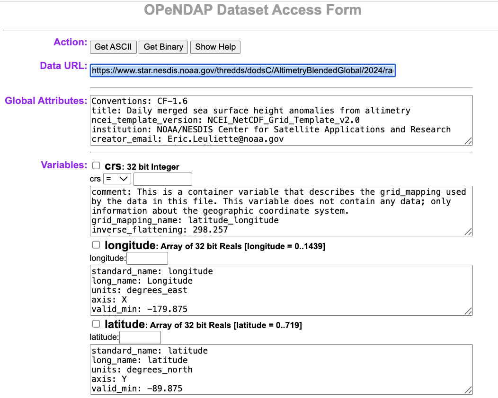

# THREDDS Downloads of CoastWatch Data

#### Dale Robinson and Madison Richardson, NOAA CoastWatch West Coast Node

> **History | Updated July 2026**

## 1. Introduction

Most CoastWatch data can also be accessed via a **THREDDS (Thematic Real-time Environmental Distributed Data Services)** server.

- THREDDS provides a **catalog-based interface** for organizing and accessing datasets.
- It is particularly useful for **discovering and aggregating data** (e.g., grouping daily NetCDF files into a single time series).
- Unlike HTTPS, which only delivers full files, **THREDDS** supports the **OPeNDAP (Open-source Project for a Network Data Access Protocol)**.
- **OPeNDAP** is a web service that lets users **remotely access and subset scientific data** (like NetCDF files) over the internet **without needing to download entire files**

In this tutorial, we will learn **R methods to remotely access and subset** scientific CoastWatch data through the THREDDS OPeNDAP service.

> **Note:** While this guide uses CoastWatch data as an example, you can use these same R steps to download files from other THREDDS web servers.

------------------------------------------------------------------------

### What You Will Learn

In this tutorial, you will learn how to:

1.  **Find a dataset:** Navigate the THREDDS catalog and locate an aggregated dataset.
2.  **Connect with OPeNDAP:** Open a remote NetCDF dataset directly in R using **ncdf4**.
3.  **Explore the dataset:** Examine its dimensions, coordinates, variables, and metadata.
4.  **Subset the data:** Select only the variables, time period, and geographic region needed for your analysis.
5.  **Create an animation:** Using the selected variable, make a timeseries animation.
6.  **Save your results:** Write the subsetted data to a local NetCDF file for future use.

## 2. Environment Requirements:

- R Version: 4.6.0+
- Dependencies: ncdf4, ggplot2, gganimate, gifski, dplyr, scales, knitr

### Library installation examples for running in a code block

``` r
# install.packages(c(
#   "ncdf4",
#   "ggplot2",
#   "gganimate",
#   "gifski",
#   "dplyr",
#   "scales",
#   "knitr"
# ))

```

## 3. Dataset for This Tutorial

We'll use the CoastWatch **Sea Level Anomaly and Geostrophic Currents** dataset for the examples in this tutorial.

- Open the [dataset documentation page](https://coastwatch.noaa.gov/cwn/products/sea-level-anomaly-and-geostrophic-currents-multi-mission-global-optimal-interpolation.html).
- The dataset documentation page provides product information, documentation, citations, and multiple ways to access the data.


## 4 Understanding THREDDS Access

The THREDDS server provides multiple ways to access and organize this dataset. For this tutorial, we will be focusing on accessing datasets through Aggregated View.

If you are interested in accessing datasets through Per-file View go to the [Appendix A](#appendix-a). If you are interested in accessing datasets from another THREDDS server, go to [Appendix B](#appendix-b).

### 4.1 Aggregated Datasets

**Aggregated View**

1.  From the dataset documentation page, scroll down and click the **THREDDS** link.
2.  Choose **Geographic Projection (Aggregated View)**.
3.  This representation groups daily files into larger aggregates, making it easier to work with extended time periods.

- **Yearly Aggregation** – e.g., 2024 (Aggregated View): all daily data for a year.
- **Life of Mission (Aggregated View)** – all data from 2017 to present in a single collection.

### 4.2 OPeNDAP (DODS) Access

Ultimately, we will use OPeNDAP (DODS) to programmatically access and subset the data.

1.  Return to the Catalog Page for Life of Mission (Aggregated View).
2.  Click OPeNDAP (DODS) to open the OPeNDAP Dataset Access Form, which displays dataset metadata.



3.  Copy the link shown next to Data URL — this is the OPeNDAP endpoint. \> opendap_url = <https://www.star.nesdis.noaa.gov/thredds/dodsC/AltimetryBlendedAggGlobalLoM>

4.  The OPeNDAP endpoint can be used directly in many tools for remote access:

- Python: e.g. xarray.open_dataset(opendap_url)
- R: e.g. ncdf4::nc_open(opendap_url)
- Panoply: File \> Open Remote Dataset \> enter opendap_url

✅ **Key Point**: The aggregated OPeNDAP endpoint provides seamless access to the full time series without having to download or manage individual daily files.

## 5. Accessing Data with the R ncdf4 library

### 5.1 Open the dataset with ncdf4 using the OPeNDAP endpoint

The `ncdf4` package provides functions for opening and reading NetCDF datasets in R. When working with an OPeNDAP endpoint, `ncdf4` connects directly to the remote dataset, allowing you to inspect its contents and retrieve only the variables and portions of the data you need.

The `nc_open()` function opens the dataset and reads its metadata, including the available variables, dimensions, and attributes. The data values themselves are **not** read until you explicitly request them with `ncvar_get()`.

``` r
library(ncdf4)

opendap_url <- "https://www.star.nesdis.noaa.gov/thredds/dodsC/AltimetryBlendedAggGlobalLoM"
ds <- nc_open(opendap_url)

ds

```

### 5.2 Explore the Dataset Structure

After opening the dataset, it's helpful to spend a few moments exploring its contents before reading any data. The metadata returned by `nc_open()` can help answer four important questions:

**What variables are available?**

Use the following command to list the scientific variables stored in the dataset.

``` r
names(ds$var)
```

For this tutorial, we will work with the `sla` (Sea Level Anomaly) variable.

**What are the dataset dimensions?**

The dimensions define the coordinate axes (such as time, latitude, and longitude) and determine the shape of each variable. They are also used when selecting subsets of the data.

``` r
names(ds$dim)
```

**What information is available for a variable?**

If you would like to learn more about a specific variable, `sla` in this case, you can inspect its metadata. This includes information such as the variable dimensions, units, and other descriptive attributes

``` r
ds$var$sla
```

### 5.3 Subsetting the dataset with ncdf4

Up until now, we've only been exploring the dataset's metadata. We haven't retrieved any of the data values yet. When we call `ncvar_get()`, that's when R requests just the subset of Sea Level Anomaly values we asked for from the THREDDS server. Those values are loaded into memory, but they aren't automatically saved as a local NetCDF file. This is especially useful for large aggregated datasets, where loading every variable, location, and time step would be inefficient.

In this example, we'll subset the dataset by latitude, longitude, and time before reading the data from the server.

**Task**: In this example, we'll select:

- **Latitude range:** 0° to 50°N
- **Longitude range:** -180° to -120°
- **Time range:** January 1, 2024 – May 31, 2024

To further reduce the amount of data retrieved, we'll keep only **every fourth time step** after reading the requested time range.

``` r
# Define subset bounds
lat_min <- 0
lat_max <- 50

lon_min <- -180
lon_max <- -120

time_min <- as.Date("2024-01-01")
time_max <- as.Date("2024-05-31")

stride <- 4
```

Before reading the Sea Level Anomaly variable, we first retrieve the latitude, longitude, and time coordinate variables. These coordinate arrays contain the actual coordinate values stored in the dataset and allow us to determine which array indices correspond to our desired geographic region and time period.

``` r
# Read the coordinate variables
lat <- ncvar_get(ds, "latitude")
lon <- ncvar_get(ds, "longitude")
time <- ncvar_get(ds, "time")
```

The `time` variable is stored as numeric values rather than calendar dates. While this format is efficient for storing data, it is difficult to interpret and use in analyses. Converting the time values to standard R `Date` objects makes it easier to subset the dataset by date, create plots, and understand when the observations were collected.

``` r
# Convert the NetCDF time variable to dates
time_units <- ncatt_get(ds, "time", "units")$value
print(time_units)

```

``` r
origin <- sub("days since ", "", time_units)

time_dates <- as.Date(time, origin = origin)

# Print last 6 dates of the full dataset
tail(time_dates)
```

Next, identify the latitude and longitude indices corresponding to our region of interest. The `which()` function returns the positions (indices) of the latitude and longitude values that fall within the requested range.

``` r
# Find the indices corresponding to your desired region and time range:
lat_idx <- which(lat >= lat_min & lat <= lat_max)

lon_idx <- which(lon >= lon_min & lon <= lon_max)
```

Next, identify the indices corresponding to the requested time range. The `which()` function returns the indices of all dates between the selected start and end dates.

``` r
# Full contiguous time range
time_idx_full <- which(
  time_dates >= time_min &
  time_dates <= time_max
)

```

Now read the Sea Level Anomaly (`sla`) data using `ncvar_get()`. Instead of retrieving the entire global dataset, we use the latitude, longitude, and time selections from the previous steps to read only the region and time period of interest.

The `start` argument specifies where to begin reading the data, while the `count` argument specifies how much data to read along each dimension. For example:

- start = "Begin reading at the first longitude, first latitude, and first date that I selected."
- count = "From that starting point, read this many longitudes, latitudes, and time steps."

``` r
# Retrieve SLA values for the selected latitude, longitude, and time indices
subset_sla <- ncvar_get(
  ds,
  "sla",
  start = c(
    min(lon_idx),
    min(lat_idx),
    min(time_idx_full)
  ),
  count = c(
    length(lon_idx),
    length(lat_idx),
    length(time_idx_full)
  )
)
```

Because we read the full time range in the previous step, we can now reduce the number of observations by keeping every fourth time step. We apply the same selection to both the Sea Level Anomaly data and the time values so that each observation remains associated with the correct date.

``` r
# Apply the stride after reading to reduce the number of time steps
stride_idx <- seq(
  1,
  dim(subset_sla)[3],
  by = stride
)

subset_sla <- subset_sla[, , stride_idx]
```

``` r
# Confirm dates are 4 days apart
time_subset <- time_dates[time_idx_full][stride_idx]
print(time_subset)
```

Finally, verify that the Sea Level Anomaly data and the corresponding dates contain the same number of time steps. This confirms that each observation is still paired with the correct date after applying the stride.

``` r
# Verify the last dimension of subset_sla matches the length(time_subset)
dim(subset_sla)
length(time_subset)

```

### 5.4 Visualize Your Results

Now that we've retrieved the subsetted data, let's create a map of the **Sea Level Anomaly (SLA)** for a single day.

Because the dataset contains multiple time steps, we first select one date to visualize. We then organize the longitude, latitude, and Sea Level Anomaly values into a dataframe so they can be plotted with **ggplot2**.

``` r
# Load plotting package
library(ggplot2)

# Select the first time step to visualize
frame <- 1

# Extract the lat and lon values for the subsetted region
lon_subset <- lon[lon_idx]
lat_subset <- lat[lat_idx]

# Create a dataframe containing every longitude/latitude coordinate pair
sla_df <- expand.grid(
  lon = lon_subset,
  lat = lat_subset
)

# Add the SLA values for the selected time step
sla_df$sla <- as.vector(subset_sla[, , frame])

# Create a raster map of SLA
ggplot(sla_df, aes(lon, lat, fill = sla)) +
  geom_raster() +
  
  # Use a red-blue color scale centered around zero
  scale_fill_distiller(
    palette = "RdBu",
    direction = -1,
    limits = c(-0.2, 0.2),
    oob = scales::squish
  ) +
  
  # Preserve the map's geographic aspect ratio
  coord_equal() +
  
  # Add title, axis labels, and colorbar label
  labs(
    title = as.character(time_subset[frame]),
    x = "Longitude",
    y = "Latitude",
    fill = "Sea Level Anomalies (m)"
  )


```

### 5.5 Animate the Time Series

Lets create an animation to show how **Sea Level Anomaly (SLA)** changes over time.

Instead of plotting a single map, we need to organize the data into a format that `gganimate` can understand. Unlike our previous example, which displayed one time step, the animation requires all time steps to be stored together in a single dataframe. A date column identifies which rows belong to each frame of the animation.

To prepare the data for animation, we will:

1.  Determine how many time steps are in the subset.
2.  Create a dataframe for each time step containing the longitude, latitude, and Sea Level Anomaly values.
3.  Add the corresponding date to each dataframe.
4.  Combine all of the individual dataframes into a single dataframe that will be used to create the animation.

``` r
# Load packages
library(ggplot2)
library(gganimate)
library(dplyr)
library(scales)

# Determine how many time steps are in the subset
n_frames <- dim(subset_sla)[3]

# Ensure dates match the number of time steps
time_subset <- time_subset[seq_len(n_frames)]

# Display the first 20 dates that will be included in the animation
head(time_subset, 20)
```

``` r
# Create a dataframe for each time step and combine them
animation_df <- do.call(
  rbind,
  lapply(seq_len(n_frames), function(i) {

    # Create a dataframe containing every lon/lat coordinate
    expand.grid(
      lon = lon_subset,
      lat = lat_subset
    ) |>
      
      # Add the SLA values for the current time step
      # and record the corresponding date
      transform(
        sla = as.vector(subset_sla[, , i]),
        date = format(time_subset[i], "%Y-%m-%d")
      )

  })
)

```

Next, use **ggplot2** to create the map that will be displayed in the animation. This is very similar to the static map we created in the previous section. The main difference is that we add `transition_manual(date)`, which tells **gganimate** to display one frame for each date in the dataframe.

``` r
# Create the animation
p <- ggplot(
  animation_df,
  aes(lon, lat, fill = sla)
) +
  
  # Draw the SLA grid
  geom_raster() +
  
  # Apply a red-blue color scale for SLA values
  scale_fill_distiller(
    palette = "RdBu",
    direction = -1,
    limits = c(-0.2, 0.2),
    oob = scales::squish
  ) +
  
  # Preserve the map's geographic aspect ratio
  coord_equal() +
  
  # Add the title, axis labels, and colorbar label
  # {current_frame} is replaced with the current date during the animation
  labs(
    title = "{current_frame}",
    x = "Longitude",
    y = "Latitude",
    fill = "Sea Level Anomalies (m)"
  ) +
  
  # Create one animation frame for each date
  transition_manual(date)

```

Finally, generate and save the animation. The `animate()` function creates the animation, and `anim_save()` saves it locally as a GIF that you can view or share.

``` r
# Render and save GIF
anim <- animate(
  p,
  
  # Display 5 frames per second
  fps = 5,
  
  # Set the size of the output GIF (pixels)
  width = 800,
  height = 400,
  
  # Render the animation as a GI
  renderer = gifski_renderer()
)

# Save the animation to a GIF file
anim_save(
  "sla_animation.gif",
  animation = anim
)

```

Display the animation.

``` r
knitr::include_graphics("sla_animation.gif")

```

### 5.6 Save the Subset to a NetCDF File

The subsetted Sea Level Anomaly data currently exists only in R's memory. To use it later or share it with others, we can save it as a new NetCDF file.

To do this, we first define the longitude, latitude, and time coordinates that will be included in the file. Next, we define the Sea Level Anomaly variable and specify that it uses these coordinates. Finally, we create the NetCDF file, write the subsetted data, and close the file to save it.

``` r
# Define the longitude coordinate
lon_dim <- ncdim_def(
  "longitude",
  "degrees_east",
  lon_subset
)

# Define the latitude coordinate
lat_dim <- ncdim_def(
  "latitude",
  "degrees_north",
  lat_subset
)

# Define the time coordinate
time_dim <- ncdim_def(
  "time",
  "days since 1950-01-01",
  as.numeric(time_subset - as.Date("1950-01-01"))
)

# Define the SLA variable
sla_var <- ncvar_def(
  "sla",
  units = "m",
  dim = list(lon_dim, lat_dim, time_dim),
  longname = "Sea Level Anomaly"
)

# Create a new NetCDF file
nc_out <- nc_create("sla_subset.nc", sla_var)

# Write the subsetted SLA data to the file
ncvar_put(nc_out, sla_var, subset_sla)

# Close the file to finish writing the data
nc_close(nc_out)

```

To verify that the file was created successfully, open it and display its contents. You should see the Sea Level Anomaly variable along with the longitude, latitude, and time coordinates that were written to the file.

``` r
# Open the saved NetCDF file
nc_check <- nc_open("sla_subset.nc")

# Display its contents
print(nc_check)

# Close the file
nc_close(nc_check)

```

The file now contains your subsetted data and can be reopened later or shared with others.

Finally, close the connection to the original dataset. This ensures that all files are properly closed before ending your session.

``` r
# Close the original dataset
nc_close(ds)

```

## 6. Summary and Tips

### In this tutorial, you learned how to:

1.  Explore and access NOAA CoastWatch data through the **THREDDS Data Server (TDS)**.
2.  Understand the difference between **aggregated datasets** and **individual files** available through THREDDS.
3.  Use **OPeNDAP** to access remote NetCDF datasets directly in R without downloading the entire file.
4.  Open and inspect a NetCDF dataset using the **ncdf4** package, including dimensions, variables, and metadata.
5.  Read coordinate variables and identify the indices corresponding to a desired spatial and temporal subset.
6.  Extract a subset of Sea Level Anomaly (SLA) data based on user-defined latitude, longitude, and time ranges.
7.  Visualize the subsetted data as both a static map and an animated time series using **ggplot2** and **gganimate**.
8.  Save the subsetted dataset to a local **NetCDF file** for future analysis and sharing.

#### Tips for Working with THREDDS and NetCDF Data in R

- **Inspect metadata first** – reviewing dimensions, variables, and attributes helps you understand the structure of a dataset before working with it.
- **Use aggregated datasets when available** – they provide a convenient way to access long time series through a single OPeNDAP endpoint.
- **Subset data before downloading** – extracting only the spatial and temporal range you need reduces data transfer and memory usage.
- **Work with coordinate variables** – latitude, longitude, and time coordinates are often used to determine the index ranges needed for subsetting.
- **Save processed subsets locally** – exporting a subset to NetCDF allows you to reuse the data without reconnecting to the remote server.
- **Visualize data throughout your workflow** – quick maps and animations are useful for validating that your subset and analysis are behaving as expected.
- **Take advantage of OPeNDAP interoperability** – the same THREDDS datasets can be accessed from R, Python, MATLAB, Panoply, GIS software, and many other scientific tools.

By combining THREDDS services with R packages such as **ncdf4**, **ggplot2**, and **gganimate**, you can efficiently access, subset, visualize, and save NOAA CoastWatch datasets for a wide range of scientific and operational applications.

## Appendix A {#appendix-a}

### What if the Data Are Not in an Aggregated View?

The aggregated OPeNDAP endpoint provides seamless access to the full time series without having to download or manage individual daily files, but some datasets may not have aggregated view. \* If only per-file views are available, you can still use OPeNDAP to access individual files programmatically. \* However, the workflow is more complicate, involving opening multiple files and concatenating them.

#### Workflow steps

Workflow using **per-file views** for the same task we accomplished with the **aggregated view**.

1.  Identify the dataset

    - Navigate to the THREDDS Per-file View directory for the dataset.
    - Note the file naming pattern (e.g., rads_global_nrt_sla_YYYYMMDD_YYYYMMDD_001.nc).

2.  Define your subset criteria

3.  Generate file URLs

    - Build a list of daily file URLs from the base THREDDS URL using the date pattern.
    - Restrict to every 4th day in the time range to reduce file count.

4.  Open and subset files

    - Loop through each file URL.
    - Open each file with ncdf4::nc_open().

5.  Concatenate results

    - Store each subset in a list and combine them into a 3D array.

6.  Inspect the results

    - Create coordinate and time vectors for the subset.
    - Explore or visualize the data.
    - Save the subset locally if desired.

#### Workflow example

``` r
library(ncdf4)

# Define spatial and temporal subset
lat_min <- 0
lat_max <- 50

lon_min <- -180
lon_max <- -120

time_min <- as.Date("2024-01-01")
time_max <- as.Date("2024-05-31")

# Base URL for Per-file view
base_url <- "https://www.star.nesdis.noaa.gov/thredds/dodsC/AltimetryBlendedGlobal/"

# Generate dates every 4 days
dates <- seq(
  from = time_min,
  to = time_max,
  by = "4 days"
)

# Generate OPeNDAP URLs
urls <- sapply(
  dates,
  function(d) {
    paste0(
      base_url,
      format(d, "%Y"),
      "/rads_global_nrt_sla_",
      format(d, "%Y%m%d"),
      "_",
      format(d + 1, "%Y%m%d"),
      "_001.nc"
    )
  }
)

# Open each file and extract the subset
subset_list <- list()

for (url in urls) {

  cat("Opening:", url, "\n")

  tryCatch({

    # Open remote NetCDF file
    nc <- nc_open(url)

    # Read coordinate variables
    lon <- ncvar_get(nc, "longitude")
    lat <- ncvar_get(nc, "latitude")

    # Find indices matching the desired region
    lon_idx <- which(
      lon >= lon_min &
      lon <= lon_max
    )

    lat_idx <- which(
      lat >= lat_min &
      lat <= lat_max
    )

    # Read the subsetted SLA variable
    sla <- ncvar_get(
      nc,
      "sla",
      start = c(
        min(lon_idx),
        min(lat_idx),
        1
      ),
      count = c(
        length(lon_idx),
        length(lat_idx),
        1
      )
    )

    # Store in list
    subset_list[[length(subset_list) + 1]] <- sla

    # Close file
    nc_close(nc)

  }, error = function(e) {

    message(
      "Could not open ",
      url,
      ": ",
      e$message
    )

  })

}

# Combine all time slices into a single 3D array
subset_sla <- simplify2array(subset_list)

# Create coordinate vectors
lon_subset <- lon[lon_idx]
lat_subset <- lat[lat_idx]

# Create time vector corresponding to successfully loaded files
time_subset <- dates[seq_len(dim(subset_sla)[3])]

# Inspect results
dim(subset_sla)

print(time_subset)

```

## Appendix B {#appendix-b}

### The Same Approach Works for Other THREDDS Servers

### 1. Dataset for This Tutorial

We will work with:

**Satellite Data/NOAA Coral Reef Watch Degree Heating Week: Daily 5-km** from the PacIOOS THREDDS Server.

- Find the PacIOOS THREDDS Catalog [here](https://pae-paha.pacioos.hawaii.edu/thredds/catalog.html).


1.  From the catalog page, scroll down and choose **Satellite Data**.
2.  Then choose the **NOAA Coral Reef Watch Degree Heating Week: Daily 5-km** dataset.

### 2. OPeNDAP (DODS) Access

We will use OPeNDAP (DODS) to programmatically access and subset the data.

1.  Click OPeNDAP (DODS) to open the OPeNDAP Dataset Access Form, which displays dataset metadata.


2.  Copy the link shown next to Data URL — this is the OPeNDAP endpoint. \> opendap_url = <https://pae-paha.pacioos.hawaii.edu/thredds/dodsC/dhw_5km>

#### Full Workflow example

``` r
library(ncdf4)
library(ggplot2)
library(gganimate)
library(dplyr)
library(scales)

# Open the aggregated dataset
opendap_url <- "https://pae-paha.pacioos.hawaii.edu/thredds/dodsC/dhw_5km"

ds <- nc_open(opendap_url)

# Define subset bounds
lat_min <- 0
lat_max <- 50

lon_min <- -180
lon_max <- -120

time_min <- as.Date("2024-01-01")
time_max <- as.Date("2024-03-31")

stride <- 4

# Read coordinate variables
lat <- ncvar_get(ds, "latitude")
lon <- ncvar_get(ds, "longitude")
time <- ncvar_get(ds, "time")

# Convert NetCDF time values to dates
time_units <- ncatt_get(ds, "time", "units")$value

origin <- sub(
  "seconds since ",
  "",
  time_units
)

time_dates <- as.Date(
  as.POSIXct(
    time,
    origin = origin,
    tz = "UTC"
  )
)

# Find indices corresponding to the desired region
lat_idx <- which(
  lat >= lat_min &
  lat <= lat_max
)

lon_idx <- which(
  lon >= lon_min &
  lon <= lon_max
)

# Find indices corresponding to the desired time range
time_idx_full <- which(
  time_dates >= time_min &
  time_dates <= time_max
)

# Read the full contiguous time range
subset_sst <- ncvar_get(
  ds,
  "CRW_SST",
  start = c(
    min(lon_idx),
    min(lat_idx),
    min(time_idx_full)
  ),
  count = c(
    length(lon_idx),
    length(lat_idx),
    length(time_idx_full)
  )
)

# Apply temporal stride after reading
stride_idx <- seq(
  1,
  dim(subset_sst)[3],
  by = stride
)

subset_sst <- subset_sst[, , stride_idx]

# Create coordinate vectors
lon_subset <- lon[lon_idx]
lat_subset <- lat[lat_idx]

# Create matching dates
time_subset <- time_dates[time_idx_full][stride_idx]

# Verify dates
print(time_subset)

# Number of animation frames
n_frames <- dim(subset_sst)[3]

# Build dataframe containing all timesteps
animation_df <- do.call(
  rbind,
  lapply(seq_len(n_frames), function(i) {

    expand.grid(
      lon = lon_subset,
      lat = lat_subset
    ) |>
      transform(
        sst = as.vector(subset_sst[, , i]),
        date = format(time_subset[i], "%Y-%m-%d")
      )

  })
)

# Create animation
p <- ggplot(
  animation_df,
  aes(
    lon,
    lat,
    fill = sst
  )
) +
  geom_raster() +
  scale_fill_gradient2(
  low = "blue",
  mid = "white",
  high = "red",
  midpoint = 17.5,
  limits = c(5, 30),
  oob = scales::squish,
  name = "Sea Surface Temperature (°C)"
) +
  coord_equal() +
  labs(
    title = "{current_frame}",
    x = "Longitude",
    y = "Latitude"
  ) +
  transition_manual(date)

# Render animation
anim <- animate(
  p,
  fps = 5,
  width = 800,
  height = 400,
  renderer = gifski_renderer()
)

# Save GIF
anim_save(
  "sst_animation.gif",
  animation = anim
)

# Close NetCDF file
nc_close(ds)

```
