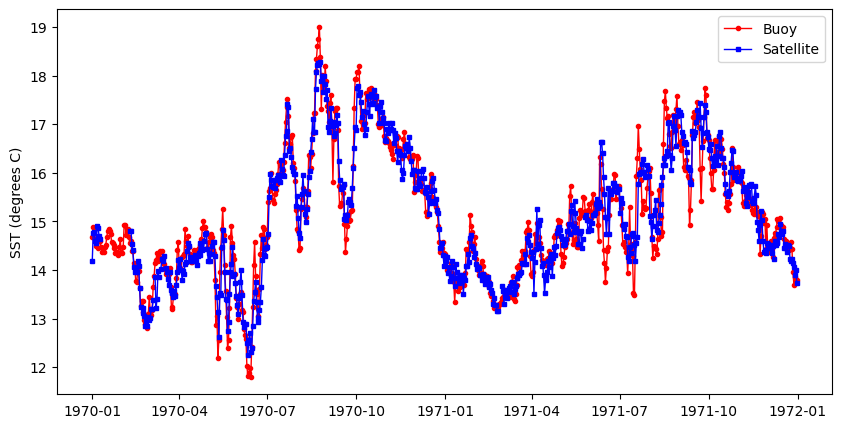
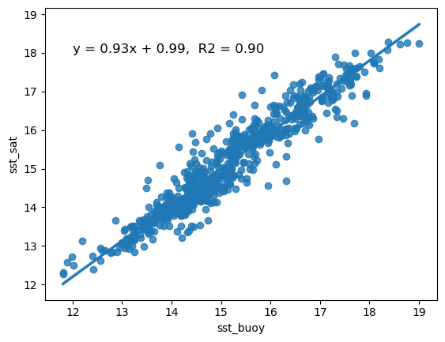

>History | Updated August 2023
## Background
There are buoys in many locations around the world that provide data streams of oceanic and atmospheric parameters. The data are often available through data centers like the  National Data Buoy Center (NDBC https://www.ndbc.noaa.gov) and ARGO floats program (http://www.argo.ucsd.edu). Despite these impressive efforts to monitor environmental conditions, in situ buoy data may not be available for your area of interest. Some locations are hard to access, making deploying and maintaining a buoy impractical. In addition, buoys are expensive to purchase, deploy and maintain. Therefore, limited funding may prevent installation of a buoy or the continued operation of a buoy already in place. 

Using satellite data to create virtual buoys can provide a solution to monitoring surface environmental conditions at locations where it is not feasible to install a buoy. For example, the University of South Florida has developed a virtual buoy system for locations off the Florida coast (https://optics.marine.usf.edu/projects/vbs.html).  

## Objectives 
The following exercise will demonstrate the use of the ERDDAP data server to create a virtual buoy. For the scenario, we will envision that a virtual buoy is needed to continue the datastream for an in situ buoy that was discontinued at the end of 2019. For this exercise we will use the National Data Buoy Center (NDBC) buoy # 46259, which is located off the California coast at 34.767N latitude and -121.497E longitude, and pretend that it was discontinued at the end of 2019. The buoy measures several oceanic variables, but we will continue the sea surface temperature (SST) datastream using NOAA GeoPolar Blended SST satellite dataset.   
 


## The tutorial demonstrates the following skills:

* __The use of ERDDAP to create a virtual buoy__      
* __The use of the pandas and xarray modules to import and manipulate data__  
* __Resampling data to bin them into a lower resolution time steps__ 
* __Generating a linear regression and statistics__
* __Plotting time-series data__  
* __Cleaning data to remove outlying data points__  

## Datasets used


__NDBC Buoy Data__  
The National Data Buoy Center (NDBC) distributes meteorological data from moored buoys maintained by NDBC and others. They are deployed in the coastal and offshore waters from the western Atlantic to the Pacific Ocean around Hawaii, and from the Bering Sea to the South Pacific. For this tutorial we will use buoy number 46259. NDBC data are available from the CoastWatch West Coast Node ERDDAP.
https://coastwatch.pfeg.noaa.gov/erddap/tabledap/cwwcNDBCMet


## Import required modules

```{python}
import numpy as np
import xarray as xr
from datetime import datetime
import os
import pandas as pd
import io
import requests
import matplotlib.pyplot as plt
import matplotlib.dates as mdates
import seaborn as sns
from sklearn.metrics import r2_score

# the %matplotlib is a magic function allow displaying results in notebooks
%matplotlib inline

# some tools for Pandas to work will with matplotlib
from pandas.plotting import register_matplotlib_converters
```

## A note about tabledap
Most of our examples in this course use gridded datasets. The NDBC data for this tutorial is a tabular dataset, served via the tabledap part of ERDDAP. The API for tabledap is a little different than for gridded datasets. You can go to the following URL and play around with subsetting. Then push the "Just generate the URL" button, copy the link, put it in a browser. See if you get what you expected.
https://coastwatch.pfeg.noaa.gov/erddap/tabledap/cwwcNDBCMet  

__A quick primer is below__

The data request URL has three parts:
1. Base URL: `https://url/erddap/tabledap/datasetID.fileType? ` 
* e.g. https://coastwatch.pfeg.noaa.gov/erddap/tabledap/cwwcNDBCMet.csv?

2. A list of variables you want to download that are separated by commas   
* e.g. station,longitude,latitude,time,wtmp

3. A list of constraints, each starting with an ampersand (&).
* The constraints use =, >, >=, <, and <= to subset the data
* e.g. &station="46259", mean station # 46259
* e.g. &time>=2017-01-01T&time<=2020-12-31', means time between and including Jan. 1, 2017 and Dec. 31, 2020.

The data request URL we will use for the NDBC data:  
`ndbc_url = 'https://coastwatch.pfeg.noaa.gov/erddap/tabledap/cwwcNDBCMet.csv?station,longitude,latitude,time,wtmp&station="46259"&time>=2017-01-01T&time<=2020-12-31`

## Download the data into a Pandas dataframe

```{python}
# Break the url into part and rejoin it so that it is easier to see.
ndbc_url = ''.join(['https://coastwatch.pfeg.noaa.gov/erddap/tabledap/cwwcNDBCMet.csv?',
                    'station,longitude,latitude,time,wtmp',
                    '&station="46259"&time>=2018-01-01&time<=2019-12-31'
                    ])

req = requests.get(ndbc_url).content
buoy_df = pd.read_csv(io.StringIO(req.decode('utf-8')), skiprows=[1], parse_dates=['time'])
buoy_df.head(2)
```

### Extract the longitude and latitude coordinates for the station
After, clean up the dataframe by deleting unneeded columns.

```{python}
buoy_lat = buoy_df.latitude[0]
buoy_lon = buoy_df.longitude[0]

# Clean up the dataset by removing unneeded columns
del buoy_df['station']
del buoy_df['latitude']
del buoy_df['longitude'] 

print('latitude', buoy_lat)
print('longitude', buoy_lon)
```

## Process the buoy data
The measurement rate of the buoy is on the order of minutes. We need to downsample the dataset to the daily resolution of the satellite dataset.   

There are a few cleanup steps that are needed:  
* The time data are associated with the UTC time zone. Panda operations often don't like time zones so let's get rid of it. 
* Rename the SST variable to something more intuitive

```{python}
print('# of timesteps before =', buoy_df.shape[0] )

# The resampling will put time as the df index
buoy_df_resampled = buoy_df.resample('D', on='time').mean()
print('# of timesteps after =', buoy_df_resampled.shape[0] )

# Remove the timezone (UTC, GMT).
buoy_df_resampled = buoy_df_resampled.tz_localize(None)

# Rename the SST variable
buoy_df_resampled.rename(columns={"wtmp": "sst_buoy"}, errors="raise", inplace=True)
buoy_df_resampled

buoy_df_resampled.head(2)
```

## Load the satellite data into xarray and subset

```{python}
# Put satellite data xarray dataset object
sst_url = 'https://coastwatch.noaa.gov/erddap/griddap/noaacwBLENDEDCsstDaily'
sst_ds = xr.open_dataset(sst_url)

# Subset the dataset
sst_ds_subset = sst_ds['analysed_sst'].sel(latitude=buoy_lat,
                            longitude = buoy_lon, method='nearest'
                            ).sel(time=slice('2018-01-01', 
                                             '2019-12-31'
                                             ))

sst_ds_subset
```

## Process the satellite data to make them compatible with the buoy data
* Put the satellite data into a Pandas dataframe
* Resample the data to daily bins: The data are already daily, but resampling them makes the timestamp format the same as for the buoy data, and puts time into the index column of the dataframe. 
* Remove the timezone localization from time

```{python}
# Initialize data
sat_data = {'time': sst_ds_subset.time.values,
            'sst_sat': sst_ds_subset.to_numpy()
            }

# Creates pandas DataFrame.
sat_df = pd.DataFrame(sat_data)

# Resample
sat_df = sat_df.resample('D', on='time').mean()

# Remove timezone
sat_df = sat_df.tz_localize(None)


sat_df.head(2)
```

## Merge the datasets

```{python}
merged_df = pd.merge(buoy_df_resampled, 
                     sat_df, 
                     left_index=True, 
                     right_index=True).reset_index()
merged_df.head(2)
```

## Plot the data along the same time (x) axis
The data from the buoy and satellite seem to track each other very well (below). 
* You will want to at least run a linear regression to determine how well satellite data reflects the in situ buoy measurements. 

```{python}
plt.figure(figsize = (10, 5)) 
# Plot the SeaWiFS data
plt.plot_date(merged_df.index, merged_df.sst_buoy, 
              'o', markersize=3, 
              label='Buoy', c='red', 
              linestyle='-', linewidth=1) 

# Add MODIS data
plt.plot_date(merged_df.index, merged_df.sst_sat,  
              's', markersize=3, 
              label='Satellite', c='blue', 
              linestyle='-', linewidth=1) 

#plt.ylim([0, 3])
plt.ylabel('SST (degrees C)') 
plt.legend()
```



## Clean up the merged dataset
Regression packages typically do not like nan's. 
* Delete rows with nan  

The data could contain data points that are outliers. Let's remove those points from the data frame. 
* Apply a conservative allowable data range. 
    - For the lower end of the range, the freezing point of seawater (ca. -2).  
    - For the high end of the range, value unlikely to be seen in the area of interest (e.g. 45 degrees C). 

```{python}
# Drop nan
clean_merged_df = merged_df.dropna()

# Drop < -2 and > 45
clean_merged_df = clean_merged_df.drop(clean_merged_df[(clean_merged_df['sst_sat'] < -2) 
                                       | (clean_merged_df['sst_sat'] > 45)].index)
```

## Run the regression

```{python}
# Regression packages typically do not like nan's. Delete rows with nan
clean_merged_df = merged_df.dropna()

# Generate the regression plot
sns.regplot(x='sst_buoy', y='sst_sat', data=clean_merged_df)

# Calculate the slope and intercept
slope, intercept = np.polyfit(clean_merged_df["sst_buoy"], clean_merged_df["sst_sat"], 1)

# Calculate R2
r2 = r2_score(clean_merged_df["sst_sat"], clean_merged_df["sst_buoy"])

# Annotate the plot
plt.annotate(f"y = {slope:.2f}x + {intercept:.2f},  R2 = {r2:.2f}", 
             xy=(12, 18), 
             #xytext=(30, 5), 
             fontsize=12, 
             color="black", 
             ha="left")

print(slope, intercept)

# To save your data, uncomment the next line
# clean_merged_df.to_csv("virtual_buoy_example.csv", index=False)
```



## It looks like your virtual buoy is ready for operations
* There is essentially a one-to-one relationship between buoy and satellite SST. The slope (0.93) is very close to 1
* The R2 indicates that 90% of the variability of satellite SST is explained by the regression. 


