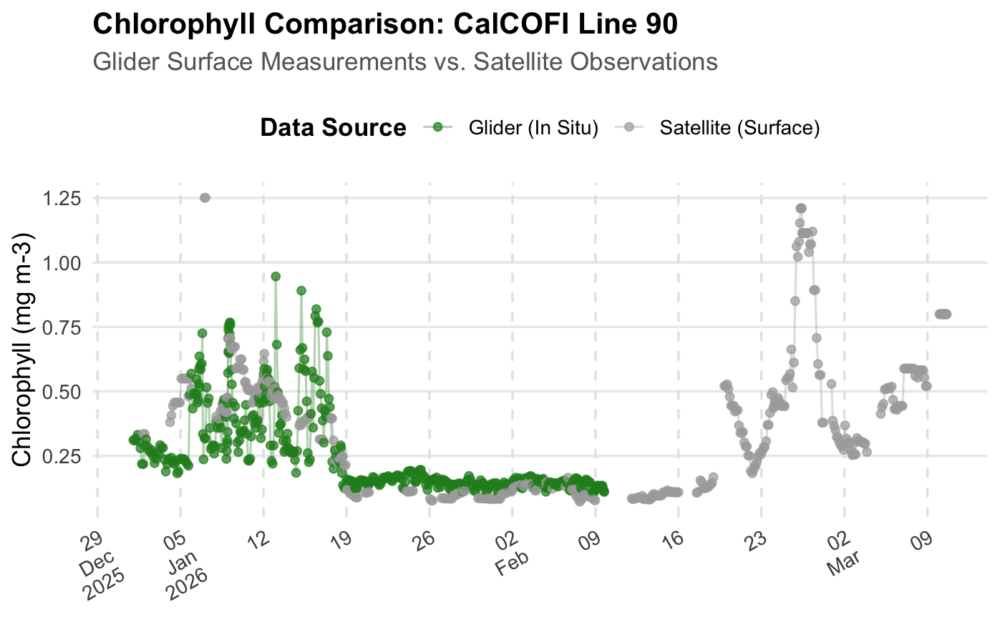
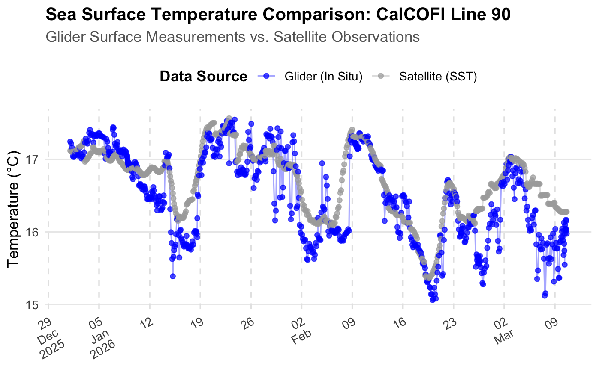
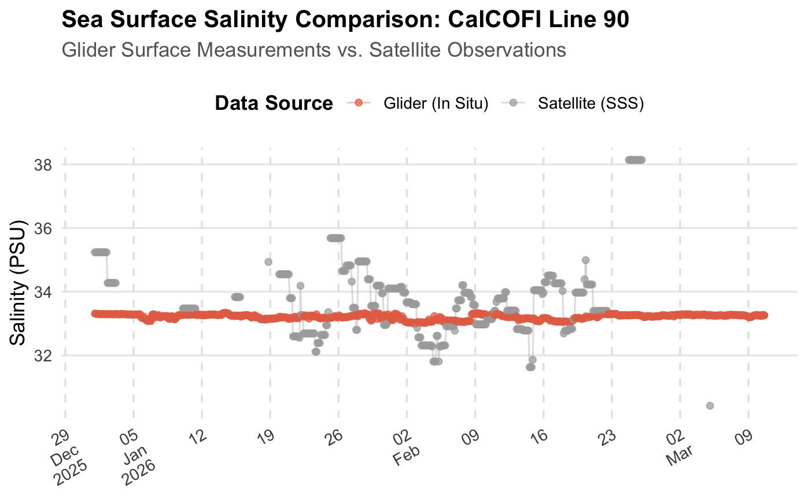

### Authors: Cara Wilson & Madison Richardson

> History | Updated Sept 2026

This tutorial demonstrates how to compare in situ ocean glider observations with satellite-derived oceanographic measurements using R.

Glider observations from CalCOFI Line 90 are retrieved from the Scripps Spray Glider ERDDAP server. Corresponding satellite observations are then retrieved from NOAA CoastWatch ERDDAP servers and matched to the glider observations in space and time.

The comparison includes:

Chlorophyll-a

Sea surface temperature (SST)

Sea surface salinity (SSS)

The workflow demonstrates how to access remote ERDDAP datasets, subset satellite data, extract satellite observations around glider locations, and visualize the resulting comparisons.

## Load packages

```{r}
packages <- c( "rerddap", "rerddapXtracto","tidyverse","scales")


# Install packages not yet installed
installed_packages <- packages %in% rownames(installed.packages())

if (any(installed_packages == FALSE)) {
  install.packages(packages[!installed_packages])
}

# Load packages 
invisible(lapply(packages, library, character.only = TRUE))

```

## Retrieve Glider Observations

The glider observations are retrieved from the Scripps Spray Glider ERDDAP server using the `rerddap` package.

For this example, observations from the **CalCOFI Line 90** dataset are requested from January through June 2026. The query retrieves position, time, depth, chlorophyll, temperature, salinity, and dissolved oxygen measurements.

```{r}
# Connect to the Scripps Spray Glider ERDDAP server
url <- "https://spraydata.ucsd.edu/erddap/"
dataset_info <- info(
  "binnedCUGN90",
  url = url
)

# Set text describing the glider transect
titletext <- "CalCOFI Line 90"

# Retrieve glider observations from January through June 2026
glider <- tabledap(
  dataset_info,
  fields = c(
    "longitude",
    "latitude",
    "time",
    "depth",
    "chlorophyll",
    "temperature",
    "salinity",
    "doxy"
  ),
  "time>=2026-01-01",
  "time<=2026-06-30"
)

```

### Select Surface Observations

Satellite products represent conditions at or near the ocean surface, while the glider collects measurements throughout the water column.

To make the measurements more comparable, the glider dataset is restricted to observations collected at **10m depth**.

```{r}
# Subset to 10m
glider_surface <- subset(glider, depth==10) 

```

## Retrieve Satellite Chlorophyll

Satellite chlorophyll-a observations are retrieved from the **ESA Ocean Colour Climate Change Initiative (OC-CCI)** daily dataset available through NOAA CoastWatch ERDDAP.

The variable `chlor_a` represents satellite-derived chlorophyll-a concentration.

```{r}
# Get information for the satellite chlorophyll dataset
dataset <- "pmlEsaCCI60OceanColorDaily"

dataInfo <- rerddap::info(
  dataset,
  url = "https://coastwatch.pfeg.noaa.gov/erddap"
)

# Select the chlorophyll variable
parameter <- "chlor_a"

```

### Match Chlorophyll Observations to the Glider Track

The longitude, latitude, and date of each surface glider observation are used to extract corresponding satellite observations.

A spatial window of ±0.2° longitude and latitude is used around each glider location. The `rxtracto()` function extracts the satellite data within these spatial windows for each glider observation.

```{r}
# Set the spatial search window around each glider location
xlen <- 0.2
ylen <- 0.2

# Get coordinates and dates for each surface glider observation
xcoords <- glider_surface$longitude
ycoords <- glider_surface$latitude
tcoords <- as.Date(glider_surface$time)

# Extract satellite chlorophyll around each glider location
chl_sat <- rxtracto(
  dataInfo,
  parameter = parameter,
  xcoord = xcoords,
  ycoord = ycoords,
  tcoord = tcoords,
  xlen = xlen,
  ylen = ylen
)

```

## Retrieve Satellite Sea Surface Temperature

Sea surface temperature is retrieved from the **NOAA CoastWatch ACSPO SST** dataset.

The same glider coordinates, dates, and ±0.2° spatial window defined for the chlorophyll comparison are used to extract satellite SST observations along the glider track.

```{r}
# Get information for the satellite SST dataset
dataset <- "noaacwLEOACSPOSSTL3SCWeeklyNRT"

dataInfo <- rerddap::info(
  dataset,
  url = "https://coastwatch.pfeg.noaa.gov/erddap"
)

# Select the sea surface temperature variable
parameter <- "sea_surface_temperature"

# Extract satellite SST around each glider location
sst_sat <- rxtracto(
  dataInfo,
  parameter = parameter,
  xcoord = xcoords,
  ycoord = ycoords,
  tcoord = tcoords,
  xlen = xlen,
  ylen = ylen
)

```

## Retrieve Satellite Sea Surface Salinity

Sea surface salinity is retrieved from the **NOAA CoastWatch SMOS 3-day Sea Surface Salinity** dataset.

The same glider coordinates, dates, and ±0.2° spatial window are used to extract satellite salinity observations along the glider track.

This dataset includes an altitude dimension, so the surface level (0) must also be specified when extracting the satellite observations.

```{r}
# Get information for the satellite salinity dataset
dataset <- "coastwatchSMOSv662SSS3day"

dataInfo <- rerddap::info(
  dataset,
  url = "https://coastwatch.pfeg.noaa.gov/erddap"
)

# Select the sea surface salinity variable
parameter <- "sss"

# Extract satellite salinity around each glider location
salinity_sat <- rxtracto(
  dataInfo,
  parameter = parameter,
  xcoord = xcoords,
  ycoord = ycoords,
  zcoord = ycoords * 0,
  tcoord = tcoords,
  xlen = xlen,
  ylen = ylen
)

```

## Combine Glider and Satellite Observations

The matched satellite chlorophyll, SST, and salinity values are added to the surface glider data.

Each row now contains the original in situ glider measurement and its corresponding satellite estimate, allowing the two data sources to be compared directly.

```{r}
# Add the matched satellite values to the surface glider data
glider_surface$chl_sat <- chl_sat$"mean chlor_a"
glider_surface$sst_sat <- sst_sat$"mean sea_surface_temperature"
glider_surface$salinity_sat <- salinity_sat$"mean sss"

```

## Compare Glider and Satellite Observations

The following plots compare the matched glider and satellite observations through time.

These comparisons provide a visual way to examine how closely the satellite products represent the conditions measured in situ by the glider. Differences may reflect spatial and temporal sampling differences between the two observing systems in addition to differences between the measurements themselves.

### Chlorophyll-a 

```{r}
# Reshape the data for plotting
glider_surface %>%
  pivot_longer(
    cols = c(chlorophyll, chl_sat),
    names_to = "source",
    values_to = "sal_val"
  ) %>%
  mutate(
    source = ifelse(
      source == "chlorophyll",
      "Glider (In Situ)",
      "Satellite (Surface)"
    )
  ) %>%

  # Plot glider and satellite chlorophyll observations
  ggplot(
    aes(
      x = time,
      y = sal_val,
      color = source
    )
  ) +
  geom_line(
    alpha = 0.35,
    linewidth = 0.5
  ) +
  geom_point(
    alpha = 0.7,
    size = 1.5,
    na.rm = TRUE
  ) +
  scale_color_manual(
    values = c(
      "Glider (In Situ)" = "forestgreen",
      "Satellite (Surface)" = "darkgray"
    )
  ) +

  # Format the time axis
  scale_x_datetime(
    breaks = breaks_pretty(n = 10),
    labels = label_date_short()
  ) +

  # Add plot labels
  labs(
    title = paste(
      "Chlorophyll Comparison:",
      titletext
    ),
    subtitle = "Glider Surface Measurements vs. Satellite Observations",
    x = NULL,
    y = "Chlorophyll (mg m-3)",
    color = "Data Source"
  ) +

  # Format the plot
  theme_minimal(base_size = 12) +
  theme(
    plot.title = element_text(
      face = "bold",
      size = 14
    ),
    plot.subtitle = element_text(
      color = "grey40",
      margin = margin(b = 10)
    ),
    legend.position = "top",
    legend.title = element_text(face = "bold"),
    panel.grid.minor = element_blank(),
    panel.grid.major.x = element_line(
      color = "grey90",
      linetype = "dashed"
    ),
    axis.text.x = element_text(
      angle = 30,
      hjust = 1
    )
  )

```



### Sea Surface Temperature

```{r}
# Reshape the data for plotting
glider_surface %>%
  pivot_longer(
    cols = c(temperature, sst_sat),
    names_to = "source",
    values_to = "temp_val"
  ) %>%
  mutate(
    source = ifelse(
      source == "temperature",
      "Glider (In Situ)",
      "Satellite (SST)"
    )
  ) %>%

  # Plot glider and satellite temperature observations
  ggplot(
    aes(
      x = time,
      y = temp_val,
      color = source
    )
  ) +
  geom_line(
    alpha = 0.35,
    linewidth = 0.5
  ) +
  geom_point(
    alpha = 0.7,
    size = 1.5,
    na.rm = TRUE
  ) +
  scale_color_manual(
    values = c(
      "Glider (In Situ)" = "blue",
      "Satellite (SST)" = "darkgray"
    )
  ) +

  # Format the time axis
  scale_x_datetime(
    breaks = breaks_pretty(n = 10),
    labels = label_date_short()
  ) +

  # Add plot labels
  labs(
    title = paste(
      "Sea Surface Temperature Comparison:",
      titletext
    ),
    subtitle = "Glider Surface Measurements vs. Satellite Observations",
    x = NULL,
    y = "Temperature (°C)",
    color = "Data Source"
  ) +

  # Format the plot
  theme_minimal(base_size = 12) +
  theme(
    plot.title = element_text(
      face = "bold",
      size = 14
    ),
    plot.subtitle = element_text(
      color = "grey40",
      margin = margin(b = 10)
    ),
    legend.position = "top",
    legend.title = element_text(face = "bold"),
    panel.grid.minor = element_blank(),
    panel.grid.major.x = element_line(
      color = "grey90",
      linetype = "dashed"
    ),
    axis.text.x = element_text(
      angle = 30,
      hjust = 1
    )
  )

```



### Sea Surface Salinity

```{r}
# Reshape the data for plotting
glider_surface %>%
  pivot_longer(
    cols = c(salinity, salinity_sat),
    names_to = "source",
    values_to = "sal_val"
  ) %>%
  mutate(
    source = ifelse(
      source == "salinity",
      "Glider (In Situ)",
      "Satellite (SSS)"
    )
  ) %>%

  # Plot glider and satellite salinity observations
  ggplot(
    aes(
      x = time,
      y = sal_val,
      color = source
    )
  ) +
  geom_line(
    alpha = 0.35,
    linewidth = 0.5
  ) +
  geom_point(
    alpha = 0.7,
    size = 1.5,
    na.rm = TRUE
  ) +
  scale_color_manual(
    values = c(
      "Glider (In Situ)" = "#E76F51",
      "Satellite (SSS)" = "darkgray"
    )
  ) +

  # Format the time axis
  scale_x_datetime(
    breaks = breaks_pretty(n = 10),
    labels = label_date_short()
  ) +

  # Add plot labels
  labs(
    title = paste(
      "Sea Surface Salinity Comparison:",
      titletext
    ),
    subtitle = "Glider Surface Measurements vs. Satellite Observations",
    x = NULL,
    y = "Salinity (PSU)",
    color = "Data Source"
  ) +

  # Format the plot
  theme_minimal(base_size = 12) +
  theme(
    plot.title = element_text(
      face = "bold",
      size = 14
    ),
    plot.subtitle = element_text(
      color = "grey40",
      margin = margin(b = 10)
    ),
    legend.position = "top",
    legend.title = element_text(face = "bold"),
    panel.grid.minor = element_blank(),
    panel.grid.major.x = element_line(
      color = "grey90",
      linetype = "dashed"
    ),
    axis.text.x = element_text(
      angle = 30,
      hjust = 1
    )
  )


```



## Summary

This tutorial demonstrated how to compare in situ glider observations with satellite-derived oceanographic measurements using R.

The workflow included:

1. Retrieving CalCOFI Line 90 glider observations from the Scripps Spray Glider ERDDAP server.

2. Selecting near-surface glider observations for comparison with satellite data.

3. Retrieving satellite chlorophyll-a, sea surface temperature, and sea surface salinity from NOAA CoastWatch ERDDAP servers.

4. Matching satellite observations to the glider track using the glider locations and observation dates.

5. Combining the matched satellite values with the glider observations.

6. Visualizing glider and satellite measurements through time.

This workflow can be adapted to other glider deployments, satellite products, time periods, and geographic regions available through ERDDAP.