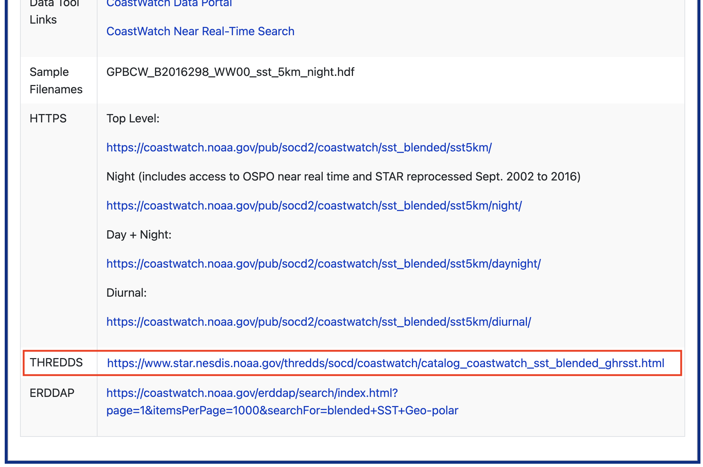
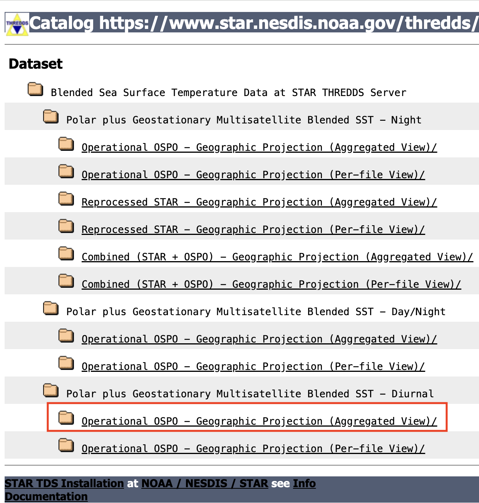
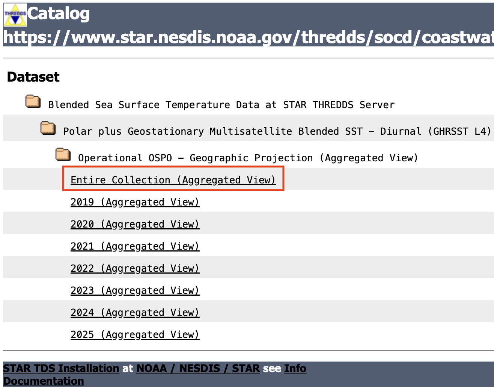
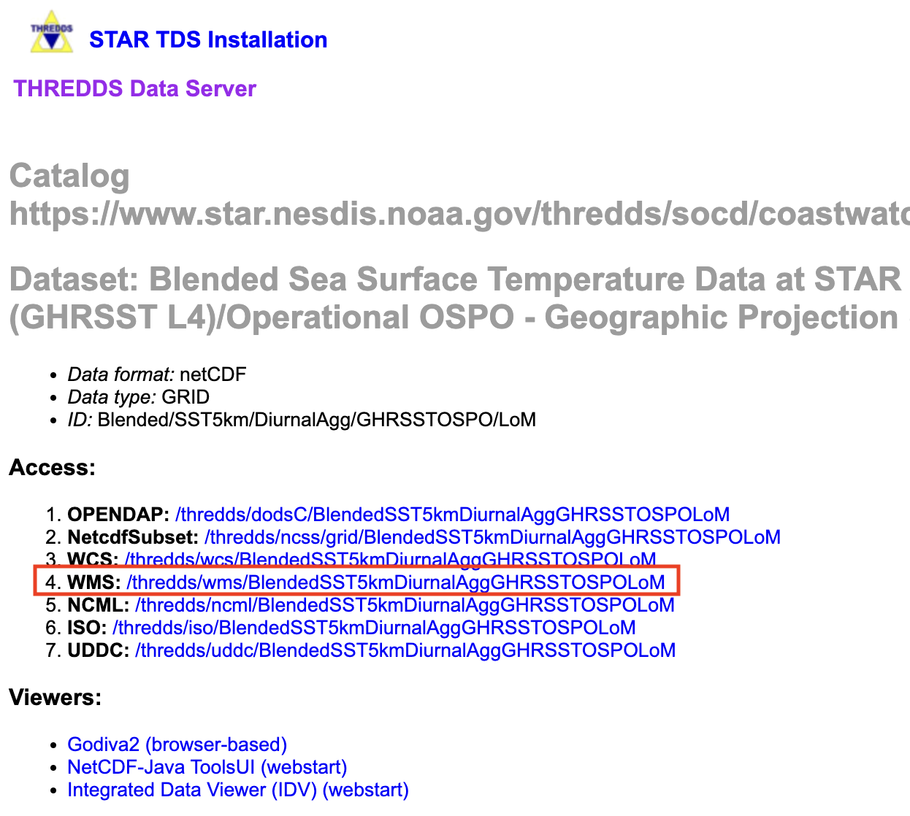

#### Author: Madison Richardson
> History | Updated August 2026

## Introduction

Most CoastWatch **THREDDS (Thematic Real-time Environmental Distributed Data Services)** servers also provide access through a **Web Map Service (WMS)**.

* A **WMS** streams **pre-rendered satellite imagery** directly into mapping applications.
* Unlike **OPeNDAP**, which returns the underlying scientific data, **WMS** returns rendered map images that are ready to display.
* As users pan and zoom around the map, Leaflet automatically requests only the imagery needed for the current view, making WMS an efficient option for interactive web maps.
* WMS layers can be customized by selecting different color palettes, value ranges, and display options without downloading the original dataset.

In this tutorial, we will learn **Python methods to stream CoastWatch satellite imagery from a THREDDS Web Map Service (WMS)** and display it in an interactive Leaflet map.

> **Note:** While this guide uses CoastWatch data as an example, you can use these same Python steps with other THREDDS WMS services that support the OGC Web Map Service standard.

---

### What You Will Learn

In this tutorial, you will learn how to:

1. **Find a WMS endpoint:** Locate a THREDDS WMS service for a CoastWatch dataset.
2. **Create an interactive map:** Display satellite imagery in an interactive Leaflet map using Python.
3. **Customize the WMS layer:** Modify the color palette, value range, and rendering options.
4. **Overlay additional data:** Add cruise station locations as interactive map markers.
5. **Add a legend:** Display a WMS-generated legend to help interpret the satellite imagery.

## Environment Requirements:
- Python Version: 3.11+ (3.12+ recommended)
- Dependencies: pandas ipyleaflet ipywidgets traitlets

### Library installation examples for running in a code block

* Option 1: For standard Python environments
    > !pip install --quiet pandas ipyleaflet ipywidgets traitlets

* Option 2: For Conda or Mamba environments
    > %conda install --quiet --yes -c conda-forge pandas ipyleaflet ipywidgets traitlets
    > Or
    > %mamba install --quiet --yes -c conda-forge pandas ipyleaflet ipywidgets traitlets


## Dataset for this tutorial

This tutorial uses the **NOAA Geo-Polar Blended Global Sea Surface Temperature Analysis (Level 4)** dataset.

This product combines observations from multiple polar-orbiting and geostationary satellites to produce a gap-filled, daily global sea surface temperature analysis at approximately 5 km spatial resolution.

Open the dataset documentation page:

- <https://coastwatch.noaa.gov/cwn/products/noaa-geo-polar-blended-global-sea-surface-temperature-analysis-level-4.html>

    

## Where to find the data

CoastWatch datasets provide several access methods, including HTTPS, THREDDS, and ERDDAP. Since this tutorial focuses on Web Map Services, we will use the THREDDS server.

From the dataset documentation page:

### 1.  Scroll down to the **THREDDS** access section.

 

### 2.  Open the **Polar plus Geostationary Multisatellite Blended SST – Diurnal Operational OSPO – Geographic Projection (Aggregated View)** dataset.

 

### 3.  Select **Entire Collection (Aggregated View)**.

The aggregated view allows a single WMS endpoint to access the complete time series instead of working with individual daily files.

 

### 4.  Click the **WMS** link.

 

### 5.  The WMS capabilities document will open in your browser.

Copy the WMS endpoint URL shown in the browser address bar. This URL will be used by Leaflet to request imagery from the WMS server.

 

## Accessing the WMS data

First, load the packages used in this tutorial.

```{python}
import pandas as pd

from ipyleaflet import (
    Map,
    WMSLayer,
    CircleMarker,
    LayersControl,
    Popup,
    LayerGroup,
    basemaps
)

from ipywidgets import HTML
from ipyleaflet import WidgetControl

from traitlets import Unicode
```

### Next, define the WMS endpoint and specify how the satellite layer should be rendered.

This section defines:

- the WMS endpoint URL
- the satellite variable to display
- the WMS color palette
- the color scale used to render the imagery

### Understanding the color range

One important detail is that the **analysed_sst** variable is stored internally in **Kelvin**, even though sea surface temperature is typically interpreted in **degrees Celsius**.

Because the THREDDS WMS server expects the color scale in the variable's native units, the `COLORSCALERANGE` parameter must also be specified in Kelvin.

For example:

| Celsius |   Kelvin |
|--------:|---------:|
|    0 °C | 273.15 K |
|   32 °C | 305.15 K |

The WMS legend displayed later in this tutorial is generated directly by the server and reflects the selected color palette and rendering style.

### Choosing a color palette

The WMS server supports multiple color palettes that control how the satellite imagery is rendered. To view the available palettes for a variable, open the WMS capabilities (XML) document and search for the **Style** elements associated with that layer. Each available palette appears as a `boxfill/<palette_name>` style (for example, `boxfill/alg`, `boxfill/sst_36`, or `boxfill/rainbow`).

The legend provided by the WMS server automatically updates to match the selected palette, so no additional changes are needed when you choose a different style.

```{python}
wms_url = (
    "https://www.star.nesdis.noaa.gov/thredds/wms/"
    "BlendedSST5kmDiurnalAggGHRSSTOSPOLoM"
)

layer = "analysed_sst"

palette = "alg"
color_range = "273,305"
```

## Cruise stations off of Monterey Bay

Next, create a small set of example cruise stations.

These locations are used to demonstrate how in-situ observations can be displayed alongside satellite imagery. In practice, these coordinates could come from ship observations, gliders, buoys, autonomous vehicles, or other field measurements.

Each point will be added to the interactive map and displayed with a popup containing its location information.

```{python}
cruise_points = pd.DataFrame({
    "station": [
        "Station 1",
        "Station 2",
        "Station 3"
    ],
    "latitude": [
        36.85,
        36.65,
        36.45
    ],
    "longitude": [
        -122.10,
        -122.35,
        -122.60
    ]
})
```

## Create the interactive map

Begin by creating an interactive Leaflet map. In this example, we use the **CartoDB Positron** basemap, center the map over **Monterey Bay**, set an initial zoom level of **6**, and enable mouse wheel zooming for easier navigation.

The map is configured with the following options:

* **basemap** – Specifies the background map used for geographic reference.
* **center** – Sets the initial latitude and longitude displayed when the map loads.
* **zoom** – Controls the initial zoom level.
* **scroll_wheel_zoom** – Enables zooming with the mouse scroll wheel.

```{python}
m = Map(
    basemap=basemaps.CartoDB.Positron,
    center=(36.7, -122.3),
    zoom=6,
    scroll_wheel_zoom=True
)
```

## Create a custom CoastWatch WMS Layer

The standard `ipyleaflet.WMSLayer` supports the core WMS specification but does not expose all of the optional parameters used by the NOAA CoastWatch THREDDS server. The custom class below extends `WMSLayer` to support the additional `time`, `colorscalerange`, and `logarithmic` parameters.

```{python}
class CoastWatchLayer(WMSLayer):

    time = Unicode("").tag(sync=True, o=True)

    colorscalerange = Unicode("").tag(sync=True, o=True)

    logarithmic = Unicode("").tag(sync=True, o=True)
```

## Add the sea surface temperature layer

Next, create a WMS layer for the **analysed_sst** variable and add it to the map. 
This layer requests sea surface temperature imagery from the NOAA CoastWatch THREDDS WMS server for **July 1, 2024** using the selected color palette and color scale.

The WMS layer is configured with the following options:

* **name** – The layer name displayed in the layer control.
* **layers** – The dataset variable to display (`analysed_sst`).
* **styles** – The WMS color palette used to render the imagery.
* **time** – The observation date and time to display.
* **colorscalerange** – The range of values mapped to the color palette.
* **transparent** – Allows the basemap to remain visible beneath the satellite imagery.
* **format** – Requests the imagery as a PNG image with transparency.

```{python}
sst = CoastWatchLayer(
    name = "Sea Surface Temperature (K)",
    url=wms_url,
    layers=layer,
    styles=f"boxfill/{palette}",
    format="image/png",
    transparent=True,
    version="1.3.0",
    attribution="NOAA CoastWatch",
    time="2024-07-01T12:00:00.000Z",
    colorscalerange=color_range,
    logarithmic="false"
)

m.add(sst);
```

## Add the cruise stations

Next, create a layer containing the example cruise stations. The stations are placed in a **LayerGroup**, allowing them to be managed as a single overlay that can be turned on or off using the layer control.

Each station is displayed as a circular marker with a popup showing the station name and coordinates.

This stations are configured with the following components:

* **LayerGroup** – Groups multiple markers into a single overlay that can be shown or hidden together.
* **CircleMarker** – Creates a circular marker at each station location.
* **location** – Specifies the latitude and longitude of each marker.
* **radius** – Sets the marker size in pixels.
* **color** and **fill_color** – Control the outline and fill colors of the markers.
* **marker.popup** – Associates an HTML popup with each marker that appears when the marker is clicked.

```{python}
cruise_layer = LayerGroup(
    name="Cruise Stations"
)

for _, row in cruise_points.iterrows():

    marker = CircleMarker(
        location=(row.latitude, row.longitude),
        radius=6,
        color="#0057e7",
        fill_color="#4da6ff",
        fill_opacity=1.0
    )

    marker.popup = HTML(
        value=(
            f"<b>{row.station}</b><br>"
            f"Latitude: {row.latitude}<br>"
            f"Longitude: {row.longitude}"
        )
    )

    cruise_layer.add(marker)
    
m.add(cruise_layer);
```

## Add a layer control

Finally, add a layer control to the map. The layer control displays the named overlays and allows users to toggle individual layers on or off interactively.

```{python}
m.add(LayersControl(position="topright"));
```

## Add legend

Finally, add a legend to the map using the WMS **GetLegendGraphic** request. Instead of creating a custom legend, the legend image is requested directly from the THREDDS WMS server. This ensures that the legend matches the selected color palette and color scale used to render the satellite imagery.

The legend uses the following components:

* **GetLegendGraphic** – A standard WMS request that returns a legend image for the selected layer.
* **LAYER** – Specifies which dataset variable the legend should represent.
* **PALETTE** – Requests the same color palette used to render the WMS layer.
* **COLORSCALERANGE** – Requests a legend using the same data range displayed on the map.
* **HTML** – Displays the legend image as an HTML widget.
* **WidgetControl** – Places the HTML widget on the interactive map.


 **Note:** The legend is generated by the WMS server, so its appearance is determined by the server implementation. Some servers may truncate portions of the legend text (such as the variable name or unit label), but the color bar and value range still accurately represent the displayed imagery.

```{python}
legend_url = (
    f"{wms_url}"
    f"?REQUEST=GetLegendGraphic"
    f"&LAYER={layer}"
    f"&PALETTE={palette}"
    f"&COLORSCALERANGE={color_range}"
)

legend = HTML(
    value=f''
)

legend_control = WidgetControl(
    widget=legend,
    position="topright"
)

m.add(legend_control);
```

## View the final map

The completed map combines all of the components created throughout this tutorial, including the basemap, streamed WMS satellite imagery, cruise station markers, layer control, and WMS-generated legend.

```{python}
m
```

## Summary

In this tutorial, you learned how to:

* Locate a WMS endpoint from a CoastWatch THREDDS server.
* Create an interactive Leaflet map using **ipyleaflet**.
* Extend the standard `WMSLayer` class to support additional CoastWatch WMS parameters.
* Stream satellite imagery directly from a THREDDS WMS service.
* Overlay in situ cruise stations on top of the satellite imagery.
* Add a layer control to toggle map overlays.
* Retrieve and display a WMS-generated legend using the **GetLegendGraphic** request.

Because WMS streams pre-rendered imagery rather than downloading the underlying dataset, it is particularly well suited for interactive visualization applications, web-based dashboards, and exploratory mapping of large geospatial datasets.

